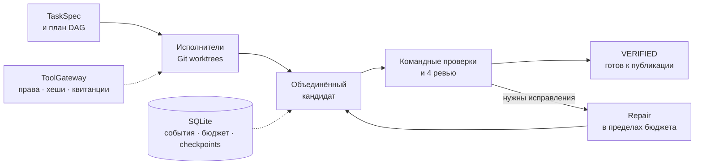

<div align="center">

# Agent Harness

**Локальная среда для агентов разработки — от задачи до проверенного Git-кандидата.**

[](https://github.com/Arkus61/agent-harness/actions/workflows/ci.yml) [](Cargo.toml) [](rust-toolchain.toml) [](LICENSE)

[Быстрый старт](#быстрый-старт) · [Подключение моделей](#подключение-моделей) · [Архитектура](#как-это-работает) · [Проверки](#проверки-и-статус) · [Документация](#документация)

</div>

Харнесс разбивает задачу на план, запускает исполнителей в отдельных Git worktrees и объединяет их изменения. Затем проверяет кандидата командами проекта и четырьмя отдельными ревью: **требования, код, тесты и безопасность**. Результат сохраняется вместе с доказательствами и отчётом; перенос в целевую ветку выполняется явно.

Ядро написано на **Rust**, состояние хранится локально в **SQLite**. Можно работать с **ChatGPT через официальный Codex CLI** или с **OpenAI-compatible моделью**, в том числе локальной.

> **Статус: 0.1.3, активная разработка.** Сборка и контрактные тесты проходят на Linux, macOS и Windows. Полная оценка качества агентов ещё впереди; поддержка MCP запланирована.

## Что уже умеет харнесс

- **Параллельная работа.** План DAG, зависимости и владение путями; каждый исполнитель работает в своём worktree.
- **Проверка результата.** Командные проверки и четыре ревью привязаны к конкретному кандидату.
- **Контроль действий.** ToolGateway проверяет доступ к файлам и командам; запись учитывает хеш исходного файла.
- **Сохраняемый запуск.** SQLite хранит события, результаты действий, бюджет и точки восстановления.
- **Управление контекстом.** Ограниченный кеш с проверкой актуальности источников, память с явным подтверждением и версионированные навыки.
- **Выбор модели.** Подписка ChatGPT или совместимый HTTP endpoint задаются в конфигурации задачи.

## Быстрый старт

### 1. Установите CLI

Нужны **Git**, **Rust / Cargo** и C-компилятор для сборки встроенного SQLite. Версия Rust **1.99.0** закреплена в репозитории; [rustup](https://rustup.rs/) выбирает её автоматически.

| Система | Инструменты сборки |
| :--- | :--- |
| Linux | C-компилятор и linker, например пакет `build-essential` в Ubuntu |
| macOS | Xcode Command Line Tools: `xcode-select --install` |
| Windows | Visual Studio Build Tools: C++, Windows SDK; **Developer PowerShell** |

```sh
git clone https://github.com/Arkus61/agent-harness.git
cd agent-harness
cargo install --path . --locked
harness --version
```

Cargo устанавливает `harness` в свой каталог `bin`, который должен быть в `PATH`. Во время работы ядру не нужны отдельный сервер SQLite, Python, Node.js или Docker. Codex CLI и инструменты оценивания устанавливаются отдельно.

<details>
<summary><b>Готовые бинарные сборки</b></summary>

Откройте [успешный запуск GitHub Actions](https://github.com/Arkus61/agent-harness/actions/workflows/ci.yml) и скачайте архив из раздела **Artifacts**:

| Сборка | Архив | Исполняемый файл |
| :--- | :--- | :--- |
| Linux x86_64 | `harness-Linux-X64` | `harness` |
| macOS ARM64 | `harness-macOS-ARM64` | `harness` |
| Windows x86_64 | `harness-Windows-X64` | `harness.exe` |

Распакуйте архив и добавьте каталог с файлом в `PATH`. На Unix при необходимости выполните `chmod +x harness`. Сохраняйте имя `harness` / `harness.exe`: CLI использует собственный executable для запуска supervisor.

Linux-сборка из Ubuntu 24.04 требует **glibc ≥ 2.39** и системные `libc`, `libm`, `libgcc_s`. Для другой среды соберите проект из исходников. Артефакты Actions имеют ограниченный срок хранения.

</details>

### 2. Запустите демо

Оставайтесь в каталоге клона. На Linux / macOS:

```sh
export CARGO_HOME="${CARGO_HOME:-$HOME/.cargo}"
export RUSTUP_HOME="${RUSTUP_HOME:-$HOME/.rustup}"
harness doctor
harness demo --dir ../harness-demo
harness --repo ../harness-demo status
```

<details>
<summary><b>Те же команды в Windows Developer PowerShell</b></summary>

```powershell
if (-not $env:CARGO_HOME) { $env:CARGO_HOME = Join-Path $env:USERPROFILE ".cargo" }
if (-not $env:RUSTUP_HOME) { $env:RUSTUP_HOME = Join-Path $env:USERPROFILE ".rustup" }
harness doctor
harness demo --dir ..\harness-demo
harness --repo ..\harness-demo status
```

</details>

Если Rust установлен в других каталогах, укажите их в `CARGO_HOME` и `RUSTUP_HOME`: проверки проекта запускаются с очищенным окружением.

Демо создаёт небольшой Rust-проект, исправляет ошибку `clamp`, выполняет настоящие тесты и четыре ревью с заранее заданными ответами. Каталог `harness-demo` должен быть **новым и ещё не существовать**.

Ожидаемый результат — **`FIXTURE_VERIFIED`**. Он подтверждает работу механики демо. Качество модели проверяется отдельными запусками; демонстрационный кандидат не допускается к `merge`. Исходный `HEAD` остаётся на baseline, поэтому этот же проект можно использовать для первого запуска с моделью.

## Подключение моделей

### ChatGPT через Codex CLI

Установите [официальный Codex CLI](https://developers.openai.com/codex/cli), добавьте `codex` в `PATH` и выполните:

```sh
harness auth status
harness auth chatgpt --device --check
harness --repo ../harness-demo run --task examples/task-chatgpt.json
```

Используется существующий вход ChatGPT либо официальный вход через браузер. Флаг `--check` делает короткий **настоящий запрос модели** и проверяет ответ с телеметрией расхода.

В [примере задачи](examples/task-chatgpt.json) пустой `provider.model` выбирает модель по умолчанию для аккаунта. Доступные модели показывает `auth status`; для воспроизводимых запусков задайте имя явно. Конфигурация содержит `allow_remote: true`: доступный контекст задачи отправляется сервису Codex. Учётные данные хранит официальный CLI.

Применяются лимиты Codex текущего аккаунта. API оплачивается отдельно. Совместимость адаптера проверялась с **Codex CLI 0.159.0-alpha.3**; после обновления CLI повторите проверку соединения. [Настройка и ограничения →](docs/CHATGPT_SUBSCRIPTION.md)

### Локальная или OpenAI-compatible модель

Запустите совместимый сервер, например Ollama. В [task-local.json](examples/task-local.json) укажите установленную модель и адрес сервера; пример использует `http://127.0.0.1:11434/v1`.

```sh
harness --repo ../harness-demo run --task examples/task-local.json
```

Backend должен поддерживать JSON-ответ через `response_format` и возвращать полную `usage` с `finish_reason: "stop"`. Модель из примера — образец конфигурации; её качество отдельно не подтверждено.

Для удалённого OpenAI-compatible endpoint задайте HTTPS-адрес, `allow_remote: true` и имя переменной с ключом в `api_key_env`. Ключ хранится в окружении, а не в JSON задачи.

### Задача для своего проекта

Возьмите один из примеров и настройте `prompt`, `requirements`, разрешения `grants`, проверки `checks` и защищённые пути `protected_paths`. Явный DAG задаётся в `nodes`; пустой список включает планирование моделью.

Проект должен быть Git-репозиторием с commit и чистыми tracked-файлами. Worktree создаётся из committed baseline; незакоммиченные файлы в него не переносятся. Для offline-проверок заранее подготовьте зависимости и закоммитьте lockfile.

```sh
harness --repo /path/to/project run --task /path/to/task.json
```

Пути к task-файлам разрешаются относительно текущего каталога. Параметр `--repo` выбирает репозиторий, в котором выполняется задача.

## Как это работает



Модель предлагает типизированные действия; выполняет их **ToolGateway**. Ревью получают требования, diff и результаты проверок. Режим `enforced` также требует допустимых оценок решений `model`, `tools` и `risk` в рамках уже выданных разрешений.

**`VERIFIED`** означает, что кандидат прошёл настроенные проверки и обязательные ревью. Истинность объяснений модели и качество решения оцениваются внешним oracle. `BLOCKED`, неизвестный расход токенов или незавершённое действие требуют разбора; автоматическое продолжение зависит от сохранённых квитанций.

### Профили исполнения

| Профиль | Где доступен | Что означает |
| :--- | :--- | :--- |
| `native-trusted` | Linux, macOS, Windows | Команды проекта выполняются с правами пользователя; это доверенный локальный запуск |
| `isolated` | Linux, после успешного probe | Bubblewrap: отдельные filesystem / PID / network namespaces и ограниченные mounts |

`harness doctor` показывает реальные возможности среды. Для `isolated` нужны bubblewrap и разрешённое создание namespaces; доступность подтверждается запуском probe. Если профиль недоступен, задача блокируется.

Unix поддерживает отдельные лимиты процессов по возможностям ОС; суммарные квоты CPU / RAM / disk для дерева процессов и resource limits на Windows ещё не реализованы. Запрос неподдерживаемого лимита отклоняется. [Контракты исполнения →](docs/LOCAL_RUNTIME_CONTRACTS.md)

## Управление результатами

Все команды возвращают JSON. Идентификатор запуска берётся из `run.id` в отчёте или из `status`.

| Действие | Команда |
| :--- | :--- |
| Список запусков | `harness --repo PROJECT status` |
| Подробности | `harness --repo PROJECT inspect RUN_ID` |
| Сохранить отчёт | `harness --repo PROJECT report RUN_ID --output report.json` |
| Запросить отмену | `harness --repo PROJECT cancel RUN_ID` |
| Продолжить допустимый checkpoint | `harness --repo PROJECT resume RUN_ID` |
| Проверить историческую проекцию | `harness --repo PROJECT replay RUN_ID` |

`resume` сохраняет исходные бюджет и deadline. Отменённые и уже проверенные запуски не возобновляются; неизвестные эффекты и расход сначала требуют подтверждения через `reconcile` / `settle`.

`merge` публикует только `VERIFIED`-кандидат: выполняет fast-forward существующей локальной ветки, которая не открыта в worktree, и проверяет ожидаемый SHA. Команда не выполняет push. Состояние и рабочие деревья находятся в `<git-common-dir>/harness/`.

[Команды восстановления, публикации и примеры инструментов →](docs/CLI_GUIDE.md)

## Проверки и статус

[CI от 2 октября 2026](https://github.com/Arkus61/agent-harness/actions/runs/37003661236) на commit **`bc4d3c2`** успешно завершился на трёх платформах:

| Проверка | Linux x86_64 | macOS ARM64 | Windows x86_64 |
| :--- | :---: | :---: | :---: |
| Основные Rust-тесты | **191 PASS** | **178 PASS** | **163 PASS** |
| Независимые AST-oracle тесты | 10 PASS | 10 PASS | 10 PASS |
| Python: oracle и контроллер оценивания | 46 PASS | 44 PASS · 2 skip | 44 PASS · 2 skip |
| `fmt`, `clippy`, release build | PASS | PASS | PASS |
| Изолированные baseline/control пары | **30/30 PASS** | — | — |

Один ручной live subscription smoke исключён из автоматического прогона на каждой платформе. Разное количество тестов связано с возможностями ОС. Baseline/control проверки подтверждают корректность корпуса задач и критериев; они не вызывают модель.

Исторический live pilot **0.1.2** прошёл 18/18 внешних приёмок, включая три случая с исправленным дополнительным grader. Свежий pilot **0.1.3** остановился с `BLOCKED` после Codex timeout и неизвестного usage. Эти результаты сохранены в отчётах и относятся к зафиксированным в них исходникам. Полный сравнительный benchmark **270 запусков** ещё не выполнен.

<details>
<summary><b>Проверки для разработки</b></summary>

```sh
cargo fmt --all -- --check
cargo clippy --locked --all-targets -- -D warnings
cargo test --locked --all-targets --no-fail-fast
harness eval
```

`eval` запускает компонентные проверки с заданными ответами. Независимые oracle и benchmark-корпус описаны в [evals/live](evals/live/README.md) и [evals/benchmark](evals/benchmark/README.md); для их контроллера нужен Python. Полный состав CI задан в [workflow](.github/workflows/ci.yml).

</details>

### Ближайшие этапы

| Направление | Следующий шаг |
| :--- | :--- |
| **MCP** | Клиентский адаптер через общий ToolGateway, проверка разрешений и протокольные тесты. В текущей версии MCP не реализован; унаследованные MCP-серверы Codex отключены |
| **Качество агентов** | Реализовать режимы B0 / B1 и выполнить сравнение с H; полный benchmark и независимая оценка reviewer-ролей |
| **Изоляция** | Backend для macOS / Windows и суммарные ресурсные квоты |
| **Длительные задачи** | Семантическое сокращение контекста, автоматический GC и цикл выбора стратегий |

## Документация

| Что нужно узнать | Где читать |
| :--- | :--- |
| Приёмка и выпуск 1.0 | [Поэтапный план](docs/superpowers/plans/2026-10-03-full-release.md) · [Состав релиза](docs/RELEASE_SCOPE_1_0.md) · [Матрица критериев](evals/release/acceptance-matrix.json) |
| Архитектура и принятые решения | [Единый план](docs/ARCHITECTURE_PLAN.md) · [Сравнение предложений](docs/ARCHITECTURE_COMPARISON.md) |
| CLI, восстановление и публикация | [Практический справочник](docs/CLI_GUIDE.md) |
| Подписка ChatGPT и протокол Codex | [Подключение ChatGPT](docs/CHATGPT_SUBSCRIPTION.md) |
| Runtime, контекст, outbox и replay | [Локальные контракты](docs/LOCAL_RUNTIME_CONTRACTS.md) |
| Решения model / tools / risk | [Контракт оценок](docs/DECISION_CONTRACT.md) |
| Память, навыки и стратегии | [Контракты подсистем](docs/knowledge-skills-strategy.md) |
| Сценарии и критерии оценивания | [План оценивания](docs/EVALUATION_PLAN.md) · [Каталог сценариев](evals/scenarios.json) |
| Отчёты локальных выпусков | [0.1.3](docs/VALIDATION_REPORT_0.1.3_2026-10-02.md) · [0.1.2](docs/VALIDATION_REPORT_0.1.2_2026-10-02.md) |

---

Распространяется по лицензии **[MIT](LICENSE)**.
