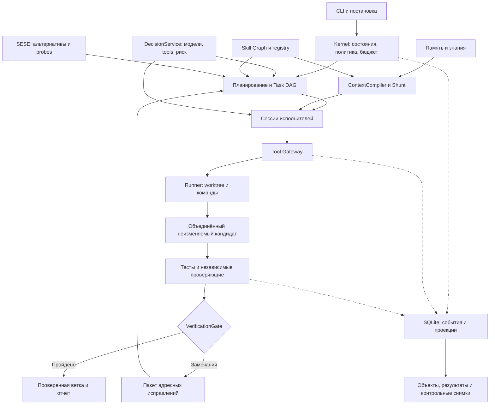

# Единый архитектурный план собственного агентского харнесса

Дата: 2026-10-01. Статус: согласованное архитектурное предложение по восьми документам и текущим указаниям пользователя. На эту дату реализация по документу ещё не началась; текущий код и CI описаны в [статусе](IMPLEMENTATION_STATUS.md), состав 1.0 — в [release scope](RELEASE_SCOPE_1_0.md), порядок приёмки — в [новом плане](superpowers/plans/2026-10-03-full-release.md).

Основной продукт: **быстрое локальное приложение на Rust для Windows, macOS и Linux**, которое декомпозирует задачи разработки, выполняет их подагентами, объединяет изменения, проверяет результат независимыми ролями и восстанавливается после сбоев. Контекст, память, граф навыков, исследование решений и Jev-подобный слой входят в общую целевую архитектуру.

Подробное сравнение всех исходников и 25 спорных вопросов: [сравнение архитектурных предложений](ARCHITECTURE_COMPARISON.md). Этот документ становится основной спецификацией предложенного старта; исходные файлы сохранены без изменений.

## 1. Требования и принятые решения

| Требование | Архитектурное решение |
|---|---|
| Собственный агент и харнесс | Собственные AgentLoop, Supervisor, контракты, policy, контекст, приёмка и recovery; Hermes не используется |
| Быстрая локальная работа | Rust/Tokio, асинхронные сессии, встроенный поиск, ограниченные очереди, кеш неизменяемых объектов |
| Кроссплатформенность | Нативные сборки и функциональные проверки Windows/macOS/Linux с первого этапа |
| Подагенты и роли | Отдельные сессии, Task DAG, атомарная выдача задач, свои worktree и среды команд |
| Независимое review/security | Новые контексты, фиксированный кандидат, отдельные проверочные среды, программный шлюз приёмки |
| Минимальный достаточный контекст | ContextCompiler, точечное чтение, Context Shunt, происхождение и возможность открыть первоисточник |
| Память | Типизированные проверяемые записи, область применимости, конфликты, устаревание, независимое повышение статуса |
| Skill Graph | Неизменяемые пакеты навыков, связи и предусловия; компиляция выбранных процедур общим DagCompiler |
| Несколько решений | SESE с ограниченным поиском, опровержением предположений, резервным вариантом и одинаковыми критериями |
| Jev-подобная нейросеть | Обязательный DecisionService: выбор модели, tools/skills и оценка риска; нейронный backend заменяем |
| Устойчивость | Транзакционные события и проекции, intents/receipts, сверка неизвестных эффектов, допуски попыток |
| Измеряемое улучшение | Сравнение с простым исполнителем, закрытые контрольные задачи, стоимость принятого результата |

Приоритет исполнения: сначала соблюдение полномочий и обязательных требований; затем качество результата; затем время и затраты. Это не мешает оптимизировать ядро с первого этапа, но запрещает ради скорости засчитывать устаревшую проверку или обходить ограничения.

## 2. Стек и поставка

| Область | Начальное решение |
|---|---|
| Язык | Rust stable; закреплённый toolchain проекта и `Cargo.lock` |
| Конкурентное исполнение | Tokio; независимые сессии агентов; семафоры и ограниченные каналы |
| Типы и внешние контракты | Serde, JSON Schema, явный `schema_version` |
| Локальная база | `rusqlite` со встроенной SQLite; WAL, foreign keys, FTS5; один поток записи |
| HTTP модели | `reqwest`/`rustls`, общий пул соединений, потоковый ответ, отмена |
| CLI | `clap`; бинарный файл `harness` |
| Поиск | `ignore`/`regex`, точечное чтение внутри процесса; AST/LSP позже |
| Объекты | Файлы по хешу BLAKE3 с указанием алгоритма; потоковая запись |
| Код и рабочие деревья | Установленный Git через аргументный адаптер; пакетное чтение объектов |
| Наблюдение | `tracing`, локальные отчёты; экспорт OTLP факультативен |
| Проверки ядра | Rust unit/integration/property tests; подменяемые модели и процессы |

Сам харнесс поставляется нативным бинарным файлом. Git, компиляторы проекта, локальная модель и конкретный sandbox остаются обнаруживаемыми внешними зависимостями. Python/Node могут быть нужны проекту или факультативному адаптеру, но не являются обязательным runtime ядра.

Начальные release-цели: Windows x64, macOS x64/arm64, Linux x64/arm64. Поддержка Windows ARM64 — отдельная проверка зависимостей. WSL не требуется самому ядру. Совместимость инструментов проекта и профиля изоляции проверяется отдельно.

Rust выбран по контролю памяти, системным библиотекам и способу поставки. Сравнительных измерений этого продукта с Go или Python пока нет. Время модели и проектных команд не приписывается языку управляющего ядра.

## 3. Форма приложения и границы модулей

Один координатор на локальный репозиторий. Подагент — самостоятельная асинхронная сессия с отдельными контекстом, ролью, полномочиями и состоянием. Процессы создаются для команд, Git и средств исполнения, а не обязательно для каждой роли.



Стрелки показывают взаимодействие, а не единую последовательную цепочку вызовов нейросети: детерминированные решения не требуют inference.

| Модуль | Единственная основная ответственность |
|---|---|
| `kernel` | Состояния, переходы, версии, события, бюджет, отмена |
| `orchestration` | Декомпозиция, готовые узлы, владельцы, аренды, зависимости |
| `agent_runtime` | Цикл модели и предложения действий; отдельные сессии |
| `execution` | Gateway, файловые средства, Git, среды команд, platform supervisor |
| `context` | Поиск, пакеты контекста, Shunt, пределы вывода и compaction |
| `decision` | Общий typed inference, вопросы, abstention, калибровка |
| `knowledge` | Память, происхождение, конфликты и применимость |
| `skills` | Пакеты, версии, связи и допустимость композиции |
| `strategy` | SESE, альтернативы, эксперименты и запись выбора |
| `verification` | Контракт, доверенные runner receipts, reviews, findings и Gate |
| `integration` | Кандидат, конфликты, поколения исправлений и публикация |
| `storage` | SQLite, объекты, индексы, восстановление и очистка |
| `evaluation` | Контрольные задачи, сравнительные прогоны и выпуск |

Это логические модули, не отдельные службы. Для старта достаточно одного Cargo-пакета с библиотекой и CLI. Выделение crates допускается по реальным границам, без воспроизведения десятков packages из D6.

## 4. Источники истины и долговечность

| Данные | Авторитетное хранилище | Производные представления |
|---|---|---|
| Постановки, контракты и конфигурация запуска | Версионированные записи и события SQLite | JSON/Markdown-экспорт |
| Run, Task DAG, попытки, бюджет | События SQLite; проекции обновляются той же транзакцией | Очередь готовых работ, интерфейс статуса |
| Принятые изменения кода | Git-коммиты и точные manifests файлов | Diff, карта кода |
| Логи, модели, отчёты и snapshots | Неизменяемые объекты, на которые ссылается SQLite | Краткие представления и пакеты контекста |
| Curated документы проекта и ADR | Git проекта, закреплённая версия | Индексы и выдержки |
| Автоматическая память | Версии записей SQLite и неизменяемое содержимое в объектах | FTS, embeddings, Git-export |
| Навыки | Пакет с content hash; опубликованная версия registry | Поисковые индексы и выбранный подграф |
| Телеметрия | Наблюдающий поток, не authority | OTLP/Phoenix/dashboard |

SQLite-события и управляемые проекции не являются независимыми писателями: команда проходит Supervisor, создаёт событие, reducer изменяет проекцию в одной транзакции. Проверка ожидаемой версии и монотонного sequence защищает от устаревшего изменения.

Объекты и база не имеют общей файловой транзакции. Сначала объект полностью записывается во временный файл на том же диске, проверяется по хешу и долговечно публикуется. Затем SQLite ссылается на него. Сбой может оставить осиротевший объект, но не должен опубликовать ссылку на частичный. На старте проверяются обязательные ссылки; missing evidence блокирует приёмку. Git-ссылки удерживают нужные ревизии от очистки.

Для критических намерений и переходов: WAL и `synchronous=FULL`. SQL работает в выделенном потоке; асинхронный runtime не блокируется. Транзакция включает событие, проекцию, резерв затрат и исходящую работу. Не журналируем каждый токен модели отдельной транзакцией.

Управляющее состояние размещается на локальном диске. Network filesystem и несколько координаторов не входят в MVP. Эксклюзивная блокировка ОС привязана к каноническому общему Git-каталогу; его worktree используют один state-root. CLI cancel/status взаимодействует с действующим координатором; второй `resume` не запускает исполнителей. PID-файл сам по себе недостаточен.

## 5. Канонические контракты

Все внешние предложения проходят проверку схемы. Внутренний reducer использует типы Rust. Исторические события имеют явные версии и миграцию чтения; неизвестное поле в текущем предложении модели не даёт права расширить контракт.

Общая оболочка сохраняемых объектов содержит `schema_version`, `project_id`, уникальный ID и `created_at_utc`; связанные с запуском объекты также содержат `run_id`. Порядок событий определяется последовательностью в журнале, а не настенными часами.

| Объект | Обязательное содержание |
|---|---|
| `TaskSpec` | Исходный запрос, task/version, требования с IDs, ограничения, scope, grants, budget root, repo/base SHA |
| `VerificationContract` | Версия постановки, requirement→checks, защищённые приёмочные материалы, критерии результата, среда, hash |
| `PlanRevision` | Выбранная стратегия, узлы и зависимости, владельцы, версии процедур, входы, checks и policy snapshot |
| `TaskNode` | Подзадача, роль, dependencies, owned/forbidden paths, требуемые интерфейсы, входы, ожидаемый output |
| `AgentAttempt` | attempt/session/task, input base, output SHA, допуск, аренда, профиль среды, лимиты, модель |
| `ActionProposal` | Точный инструмент и версия, argv/patch/endpoint, purpose, resource hashes, scope, effect class |
| `ActionIntent/Receipt` | Логический action ID, канонический hash, состояние до действия, результат, внешняя квитанция или unknown |
| `ContextBundle` | Постановка, необходимые источники, hashes, authority, проверенность, confidentiality, omissions, budget |
| `EvidencePacket` | Claims по типам, ссылки на первоисточник, точные фрагменты, выводы отдельно, coverage/unknowns |
| `DecisionAssessment` | Purpose, вопросы/варианты, типизированные ответы, backend/rubric/calibration версии, input hash, abstention |
| `SolutionProposal` | Стратегия решения, assumptions, критерии, probes, риски и оценки |
| `VerificationCandidate` | Уже собранный код: base/commit/tree SHA, generation, постановка, contract/policy/config/environment hashes |
| `CheckResult` | Candidate/check IDs, полный набор проверяемых версий, статус, receipts, findings, наблюдаемые ограничения |
| `MemoryRecord` | Тип claim, provenance/evidence, область, версия, состояние применимости, конфликты и supersession |
| `SkillVersion` | Неизменяемый manifest/body hash, inputs, permissions, prerequisites, effects, verifiers, lifecycle |

`SolutionProposal` и `VerificationCandidate` — разные сущности. Первый является гипотезой о способе решения; второй — конкретным состоянием кода для проверки. Слово candidate не используется без уточнения типа.

Исходный запрос неизменяем; уточнение создаёт новую TaskSpec. Acceptance criteria могут быть предложены моделью, но не отменяют исходный текст и не расширяют область. Неустранимая неоднозначность существенного требования ведёт к уточнению, а не к удобной трактовке.

Проверочный контракт закрепляется до исполнения. Обычные продуктовые тесты можно менять в рамках задачи; защищённый независимый набор и правила приёмки — только через отдельный `ContractAmendment` с новой версией. Прежние провалы сохраняются.

## 6. Состояния и графы

Run:

```text
RECEIVED → ASSESSING → PLANNING → EXECUTING → INTEGRATING → VERIFYING → VERIFIED
                           ↑                                     ↓
                           └──────────── REPAIRING ──────────────┘
```

Отдельные состояния: BLOCKED, FAILED, CANCELLED, BUDGET_EXHAUSTED. BLOCKED содержит конкретную причину и условия продолжения. После исправления появляется новая ревизия плана и новый кандидат. Только Supervisor меняет Run.

Состояния разных объектов не смешиваются:

- TaskNode: PENDING, READY, RUNNING, OUTPUT_READY, FAILED, CANCELLED. Завершённый локальный output не означает приёмку всего продукта.
- Attempt: CREATED, ACTIVE, OUTPUT_PROPOSED, SEALED, FAILED, CANCELLED, ORPHANED.
- Action: PREPARED, STARTED, SUCCEEDED, FAILED, NEEDS_RECONCILIATION.
- Check: NOT_RUN, RUNNING, PASS, FAIL, ERROR, INCONCLUSIVE, NOT_APPLICABLE.
- Publication: NOT_REQUESTED, REQUESTED, IN_PROGRESS, PUBLISHED, FAILED, NEEDS_RECONCILIATION.

VERIFIED означает проверенный результат, не факт публикации. NOT_APPLICABLE разрешает только политика для условного check; обязательная проверка не может быть пропущена.

| Граф | Назначение | Правила |
|---|---|---|
| Skill Graph | Постоянная библиотека процедур и отношений | REQUIRES ацикличен; альтернативы могут иметь обратные связи, обход ограничен |
| Solution Search Graph | Гипотезы, мутации и отвергнутые варианты | Существует только в рамках поиска, не управляет исполнителями напрямую |
| Execution DAG | Конкретный выбранный план задач | Нет циклов, неразрешённых входов или скрытого расширения прав |
| Dependency Graph свидетельств | Применимость памяти, checks, контекста | Изменение входа инвалидирует зависимые представления |

Fallback и repair не добавляют обратное ребро в старый DAG: создаётся новая PlanRevision с переходом через FSM. Подсистемы не заводят собственную конкурирующую Run state machine.

## 7. Планирование и подагенты

Модель предлагает разбиение. Координатор валидирует покрытие требований, ацикличность, размеры задач, ресурсные пределы, owners, наблюдаемые результаты и доступные инструменты. Каждый исполняемый узел имеет проверяемый контракт результата.

Выдача задачи и резерв затрат атомарны. Attempt получает lease и монотонный fencing token. Сессии не пишут напрямую в базу; принимающий адаптер проверяет допуск. После отмены или повторной выдачи прежний ответ не обновляет состояние.

У соседних исполнителей нет одновременного владения пересекающимися путями по умолчанию. Конфликт требует сериализации, изменения декомпозиции или отдельного владельца. Это снижает Git-конфликты, но не заменяет проверку смысловой совместимости.

Подзадача с зависимостью стартует после нужного локально проверенного output предшественника. Координатор готовит её input snapshot с точными версиями зависимостей. Она не ждёт итогового Gate всей задачи — это создало бы круговую зависимость. Output остаётся предварительным до общей приёмки.

Изменение общего API/схемы публикуется компактным событием контракта. Затронутые работы останавливаются или получают новую версию входов. Передача содержит артефакты, точные интерфейсы и ограничения; интерпретация предыдущего агента не заменяет исходные требования.

Предлагаемые стартовые пределы: два исполнителя, два независимых review-вызова одновременно, одна тяжёлая сборка. Они конфигурируются отдельно и уточняются по памяти, процессору и локальной модели.

## 8. Среды исполнения и платформенный слой

`git worktree` разделяет файлы, но имеет общий Git-каталог. Встроенные инструменты сессии не дают доступ к общей `.git` и управляющему состоянию; Git-мутации выполняет координатор.

| Профиль | Когда использовать | Доступные гарантии |
|---|---|---|
| `native-trusted` | Явно доверенный локальный проект; быстрый запуск команд | Cwd, ограничения переданного env и вывода, таймаут, управляемые потомки. Команда имеет права пользователя; это не файловая/сетевая изоляция |
| `isolated` | Политика требует ограничить недоверенное исполнение | Только проверенные возможности адаптера: mounts, сеть, процессы, ресурсы, защищённые исходники |

Выбор профиля хранится в проектной настройке; подтверждение каждой заранее разрешённой команды не нужно. Если требуемой возможности нет, задача блокируется; автоматического ослабления нет. Наличие Docker/Podman не считается достаточной гарантией без проверки конфигурации. На macOS/Windows контейнерная среда может требовать VM и иметь другую стоимость подготовки.

Strict-профиль не раскрывает общую `.git`, другой worktree, управляющие объекты, provider credentials, домашний каталог или Docker socket. В native эти запреты действуют для встроенных средств, но произвольная команда того же пользователя технически имеет больше возможностей. Защита журнала от такого кода гарантируется только подходящим isolated-профилем.

Платформенные обязанности:

- Linux/macOS: управляемая группа процессов, мягкая остановка, затем принудительная. Намеренный выход из группы требует более сильной изоляции.
- Windows: Job Object без breakaway, `KILL_ON_JOB_CLOSE`; процесс включён в Job до начала выполнения.
- Восстановление: идентичность процесса, время запуска и attempt, а не только повторно используемый PID.
- Файлы: PathBuf/OsString, Unicode и нативные имена, case sensitivity, junction/symlink/reparse, разные диски и sharing semantics. File operations защищены от изменения объекта между проверкой и использованием в границах выбранного профиля.
- Команды: массив аргументов и явный cwd. Проектный shell-сценарий имеет указанную оболочку и проходит тот же Gateway; поиск «опасных слов» не считается enforcement.
- IPC: Unix domain socket либо Windows named pipe с правами текущего пользователя, ограничением сообщений и версией протокола. Постоянная фоновая служба не обязательна.

Git-адаптер не запускает недоверенные hooks, filters или внешние helper из репозитория в управляющем процессе. Скрипты навыков и проекта запускаются выбранным Runner.

До фиксации output координатор завершает управляемые процессы, подтверждает остановку, проверяет фактический diff и сохраняет коммит. Неопределённое состояние среды не принимается как завершённое. Старый fencing token блокирует принятие результата, но сам по себе не прекращает процесс.

## 9. Политика, происхождение и право действия

PolicyEngine — чистая проверка действующих grants, scope, типа эффекта, конфиденциальности, версии среды и обязательных gates. Jev, навык, внешняя страница, MCP или другая модель не добавляют grants.

Общие capability-интерфейсы провайдеров описывают возможности реализации; permission grants описывают полномочия конкретного запуска. Это разные понятия.

У данных отдельные поля: authority, verification_status, confidentiality, provenance и applicability. Проверенный факт не получает права задавать инструкции. Сжатие недоверенного текста не делает его доверенным. Разрешение читать приватный файл не означает разрешение отправлять его облачной модели.

Before-call pipeline:

1. Проверить схему, actor/task/attempt, версию инструмента и бюджет.
2. Нормализовать точный ActionProposal и вычислить минимальные фактические permissions.
3. Применить программные ограничения. Жёсткий DENY не вызывает бессмысленную дополнительную модель.
4. Если политика требует, получить semantic risk assessment для этих точных входов.
5. Проверить актуальность grants, ресурсов, среды и assessment; зарезервировать действие и сохранить intent.
6. Исполнить через зарегистрированный Runner/адаптер.
7. Сохранить trusted Receipt, артефакты и результат, проверить postcondition.
8. Передать сессии только допустимое ограниченное представление.

Отслеживается поток данных: чувствительный источник → производный пакет → backend/лог/публикация. Отдельно допустимые read и send не означают допустимость их композиции. Чувствительный текст не отправляется внешнему classifier для решения, можно ли отправлять его наружу.

Overrides ролей/задач могут сузить права. Расширение выдаёт уполномоченный владелец как новую версию разрешения. Уже действующее разрешение применяется без повторного вопроса. Необратимое действие при необходимости рассматривается по конкретным аргументам и готовому результату.

Запуск фиксирует обычную конфигурацию. Явное уточнение владельца и отзыв допуска/карантин навыка могут остановить будущие действия; эти события имеют новую версию и инвалидируют зависимые решения. Builder не меняет активную policy редактированием файла проекта.

## 10. DecisionService и Jev-подобный слой

Три обязательных назначения:

1. ModelRouter: разрешённая модель с подходящими возможностями, качеством, временем и стоимостью.
2. Tool/SkillResolver: небольшой допустимый набор операций и версий процедур.
3. ActionRiskGate: сигнал о выходе из scope, раскрытии данных, необратимости и подозрительном потоке действий.

Уровни исполнения: L0 — точные программные правила; L1 — типизированная оценка лёгкой моделью; L2 — reasoning при сложной неоднозначности. Модель не вызывается для ответа, который надёжно вычисляет код.

`DecisionRequest` содержит purpose, task/version, state/source hashes, точные вопросы и разрешённые варианты, completeness, конфиденциальность, deadline и бюджет. `DecisionAssessment` фиксирует backend/model/question/rubric/calibration версии, ответы, usage и ограничения.

Типы ответа: Choice, Score, Noul-подобная оценка утверждения и явный Abstain. Статистика распределения Choice/Score и оценка утверждения не смешиваются с эмпирической вероятностью правильности. Общего обязательного поля «confidence=0.95 значит безопасно» нет.

| Случай | Поведение |
|---|---|
| Жёсткий запрет | DENY независимо от assessment |
| Допустимое действие и все требуемые проверки | Продолжить в выданном scope |
| Повышенный семантический риск | HOLD/REVIEW по policy |
| Неполный ввод, timeout, NaN, неизвестный вариант | Abstain; требуемый риск-gate не считается пройденным |
| Недоступен backend для заранее разрешённого чтения | Только предусмотренный policy read-only fallback |
| Недоступен обязательный gate изменения | Остановка либо разрешённая независимая дополнительная проверка; не silent allow |

Assessment связывается с exact action hash, grants и resource/environment versions. Переписанный аргумент, patch или адресат требует новой оценки. Cache имеет полный набор входов; общая оценка «эта команда обычно безопасна» не заменяет проверку конкретного действия.

Нейронный backend включается сначала в shadow mode внутри уже защищённой политики. В первом цикле есть DecisionService и один backend-кандидат; автономная маршрутизация и семантические остановки активируются после оценки их пригодности. Целевая архитектура сохраняет нейронный слой даже если конкретный Jev API не выбран.

Режим `shadow` проверяет качество рекомендаций и не выдаёт разрешений. Если политика конкретного действия уже требует действующей семантической проверки, отсутствие пригодного backend приводит к HOLD либо к явно разрешённой проверке reasoning-моделью. Режим `shadow|enforced` и версия правила входят в manifest действия и проверки.

Backend сравнивается с правилами и reasoning verifier на собственных задачах. Измеряются пропущенные риски по категориям, ложные остановки, abstention, правильность маршрута, русский/английский ввод, p95 и вся стоимость повторов. Два согласных классификатора не считаются независимым доказательством безопасности.

Уведомления строятся из rule IDs, action arguments и свидетельств; содержат конкретный scope и допустимый следующий шаг. Сам классификатор не обязан генерировать свободное объяснение. Предупреждение не запрашивает повторное разрешение уже авторизованного действия; HOLD сохраняет конкретную причину блокировки.

## 11. ContextCompiler, Repository Intelligence и Context Shunt

Путь получения сведений:

```text
Задача → точный/лексический поиск → небольшой набор источников
       → нужные символы/фрагменты → при необходимости worker extraction
       → EvidencePacket → ContextBundle под выбранную роль
```

В MVP: поиск путей, текст, SQLite FTS5, карта файлов и точное чтение. AST/tree-sitter/LSP и embeddings добавляются при измеренном выигрыше. Метаданные модели/профиля позволяют выбрать достаточную ёмкость контекста; если обязательные сведения не помещаются, выбирается разрешённый более ёмкий backend или работа блокируется.

Context Shunt — часть этого процесса, не отдельный orchestrator. Предпочтение: deterministic extraction → narrowing → targeted read → semantic compression, когда она оправдана. Порог учитывает bytes/tokens/формат/риск, не только строки.

EvidencePacket различает исходный факт, гипотезу worker, вывод reasoning и требование пользователя. У каждого существенного claim источник, hash, scope и ограничение проверки. Hash и наличие цитаты подтверждают происхождение, а не истинность содержательного вывода.

Проверяются все критические ссылки и применимость. Для некритических содержательных выводов допустима заданная policy выборка; структурная валидация пакета обязательна. Несколько пересказов одной страницы не считаются независимыми источниками.

До изменения кода читается точный актуальный фрагмент. Patch привязан к content hash; устаревший фрагмент не применяется к новому состоянию. Summary помогает найти код, но не заменяет точный вход редактирования.

Большой stdout/ответ MCP сохраняется как разрешённый объект и возвращает ссылку, ограниченную выдержку, размеры и truncation. Даже `cat` через command runner не обходит лимит payload, отправляемого модели. Ограничение контекста не объявляется запретом чтения файлов на уровне ОС.

Scouts отвечают с областью поиска: present / not_found_within_scope / unknown. Отсутствие упоминания в сводке не означает отсутствие функции во всём репозитории. Main/reviewer могут расширить конкретный фрагмент или проверить omitted источник в пределах бюджета.

Пакет содержит source coverage, omissions, contradictions и known unknowns. Агрессивное сжатие не удаляет обязательные ограничения. Compaction собирает новое рабочее представление из структурированного состояния, а не пересказывает прежнюю сводку. Оригиналы, которые разрешено хранить, сохраняются по retention policy.

Secret filtering происходит до передачи provider и до обычного сохранения логов. Секрет не копируется в память ради полноты истории. Если нужен защищённый оригинал для диагностики, применяются отдельные разрешения и хранилище; очищенная версия имеет собственный hash и указание трансформации.

## 12. Память и накопление опыта

Разделяем рабочие состояния, факты проекта, решения, эпизоды, ошибки, процедуры, security assumptions и предпочтения. WorkingState — проекция управления; долгосрочная память не подменяет её.

Curated ADR и документация в Git остаются первоисточниками своих утверждений. Автоматическая память хранится в SQLite и объектном store. Git-export `.memory` — факультативная версия для просмотра/обмена, без Git-коммита на каждое наблюдение. Это явное изменение D3 ради единой транзакционной записи и лёгкой локальной работы.

```text
Observation → Candidate → проверка источника, конфликта и scope
            → Verified/Active → Contested/Stale/Superseded/Archived
```

Каждая версия содержит происхождение, evidence, project scope, наблюдавшуюся ревизию, срок/условия применимости и связь замещения. Смена кода не обязана обесценивать все знания; инвалидируются зависимости конкретного утверждения. Неполная причина провала не превращается в универсальное «эта стратегия не работает».

Модель предлагает Candidate. Проверку могут дать первоисточник, test, experiment и независимая роль; статус задаёт MemoryService. Количество повторов и use count не повышают истинность автоматически. Противоречия сохраняются; более новая запись не побеждает без проверки области и источника.

Доступ reviewers исключает self-reported conclusions текущего builder. Разрешены проверенные исходные документы и факты с независимым происхождением. Память для экспериментального обучения и закрытой приёмки разделена.

Запись после Run асинхронна, идемпотентна и имеет отдельный статус. Её сбой не отменяет уже проверенный результат кода. Продвижение эпизода в процедуру и навык требует отдельной версии и оценки. Карантин, retention и очистка учитывают ссылки действующих проверок и snapshots.

MVP памяти: exact/FTS search, lifecycle, provenance, применимость, конфликт, supersede. Embeddings и автоматическая консолидация — последующие этапы.

## 13. Skill Graph

Пакет: manifest, инструкция, скрипты/шаблоны, tests и hashes. Body не помещается в рёбра графа и не загружается целиком всем ролям. SkillVersion неизменяем; published registry связывает её с capabilities, предусловиями, effects, required permissions и verifiers.

Начальные отношения: REQUIRES, USES_TOOL, VERIFIED_BY, NEEDS_CONTEXT, REQUESTS_CAPABILITY, ALTERNATIVE_TO, CONFLICTS_WITH, SUPERSEDES. Рёбра имеют версии и provenance. ExecutionPlan закрепляет точные версии навыков и связей, а не `latest`.

Жизненный цикл: CANDIDATE → SCANNED → TESTED → VERIFIED → APPROVED; отдельно DEPRECATED/QUARANTINED. Успешный import scan не означает безопасность всех будущих запусков. Runtime каждый раз проверяет реальные permissions и актуальные запреты.

```text
Task capabilities → lexical candidates → hard filters
                  → bounded graph expansion → допустимые PlanPath fragments
                  → общий StrategySelector → общий DagCompiler
```

Отбор фильтрует статус, среду, tools, permissions и конфликты. Обход ограничен глубиной, узлами, временем и visited. Недостижимое предусловие не маскируется semantic similarity. REQUIRES-циклы отклоняются до исполнения.

Предлагаемый начальный набор: локализация дефекта, воспроизведение, поиск существующей реализации, минимальное исправление, независимая проверка, исследование первоисточника. Сначала каталог и versions; граф полезности сравнивается с тем же каталогом.

Историческая успешность хранит sample size, контекст применения и неопределённость. Пять успешных применений не превращаются в безусловную вероятность успеха 100%. Learned selection не имеет права активировать новый навык или расширить permissions.

## 14. SESE: исследование и выбор решения

SESE отвечает за выбор стратегии задачи. Навыки дают варианты её выполнения, а DecisionService — typed assessments. Финальный выбор фиксирует один StrategySelector после программных ограничений.

| Режим | Поведение |
|---|---|
| SIMPLE | Один пригодный путь с причиной: atomic, known fix либо no_valid_alternative |
| STANDARD | Цель 2–3 существенно разных описания; одинаковые критерии; probes максимум двух |
| DEEP | Больше кандидатов/глубины и прототипов в явно заданном профиле с общим бюджетом |

Нетривиальный/рискованный выбор рассматривает альтернативы либо сохраняет обоснованное исключение. Не создаём фиктивные варианты ради количества. Раздельные контексты генераторов и разные priors полезны; параллельное исполнение всех вариантов не обязательно.

Порядок:

1. Проверить одну неизменяемую постановку и критерии.
2. Предложить разные механизмы, assumptions, scope и необходимые разрешения.
3. До дорогого прототипа исключить известные нарушения hard constraints.
4. Неопределённое обязательное условие пометить UNKNOWN и назначить probe. UNKNOWN не считается ни выполненным, ни доказанным нарушением.
5. Выполнить ограниченные experiments, одинаковые применимые checks и независимое опровержение ключевых assumptions.
6. Сравнить измеренные параметры в одинаковой среде; предположения не выдавать за measurements.
7. Сохранить недоминируемые допустимые варианты; при неполных данных отметить неопределённость сравнения.
8. Выбрать по версии критериев, записать отклонения, runner-up и switch conditions.

Judge видит требования, нормализованные варианты и evidence без автора, фаворита и предпочтительного rank. Разногласие по проверяемому свойству превращается в experiment, не majority vote. Числовые utility/VoI считаются эвристиками, пока их модели не откалиброваны.

Выбранная стратегия ещё не является принятым кодом. Она компилируется в Task DAG, исполняется и проходит итоговую приёмку. Переключение к runner-up проверяет применимость к текущей постановке и внешние эффекты; старый Git rollback не отменяет выполненный API-вызов.

Beam/MCTS, learned value и расширенное дерево поиска откладываются до результатов bounded baseline. EvidenceStore и BudgetManager не откладываются: это общие фундаментальные сервисы.

## 15. Интеграция, проверка и адресное исправление

Координатор фиксирует input_base_sha и output_sha каждой попытки. Зависимый worktree уже может содержать output предшественника; переносится только собственная delta этой попытки. Общий кандидат собирается в отдельном интеграционном дереве в порядке зависимостей.

Конфликт получает владельца и отдельную задачу. После сборки исходники фиксируются как неизменяемый VerificationCandidate. Идентификатор проверки включает постановку, contract, candidate tree, policy/config, среду, toolchain/lockfiles, fixtures и дополнительные тесты, необходимые для данного check.

Для модельной проверки manifest также закрепляет роль, модель, prompt/rubric, `ContextBundle` и выбранные SkillVersion; для программной — точную команду и hash проверяющего инструмента. Изменение любого существенного входа создаёт новую проверку. Полный журнал входов позволяет отличить повторное воспроизведение от независимой повторной оценки.

Проверяемые уровни:

- Быстрые локальные checks во время работы — обратная связь.
- Детерминированные итоговые checks — build/type/lint/tests/reproduction и конкретные критерии проекта.
- Независимые profiles — requirements, code, tests, security; интеграционный при нескольких ветках.
- Специализированные — dependencies, migrations, public API, architecture, performance, release по правилу изменения.

Security-проход обязателен для кандидата кода; глубина увеличивается на чувствительных участках. Policy enforcement нужен до первого действия независимо от наличия security reviewer.

Reviewer получает новую сессию, исходную задачу, закреплённый контракт, точный кандидат, нужный код, trusted runner results и curated контекст. Не получает частную цепочку рассуждений автора, его самооценку или summary «всё прошло». Tool traces допустимы как наблюдения. Независимый контекст не гарантирует статистической независимости моделей.

Встроенный доступ reviewer к продукту read-only. Команды выполняются в отдельной проверочной среде. В isolated исходники реально защищены от записи; writable results отдельны. В native-trusted проверяется копия и hashes до/после; изменение аннулирует результат, но намеренное изменение и восстановление во время команды этим не исключается. Политика приёмки учитывает фактический профиль.

Test Adversary добавляет тесты отдельным hashed overlay, не меняет продуктовый кандидат. Для включения теста в проект создаётся обычная задача изменения и новый кандидат. Защищённый baseline не доступен builder на запись.

Gate разрешает VERIFIED только при наличии актуальных PASS всех обязательных checks, отсутствии открытых блокирующих findings, выполнении scope и требований среды. ERROR/INCONCLUSIVE/NOT_RUN не считаются PASS. Подтверждённые критические/high дефекты блокируют; неподтверждённое серьёзное опасение инициирует дополнительную проверку и HOLD, а не исчезает из-за отсутствия воспроизведения. Неблокирующие замечания остаются в отчёте согласно policy.

Сводный batch ждёт запущенные обязательные роли. Несколько FAIL образуют один пакет findings. Если детерминированная фаза провалилась, batch закрывается неуспешно без ожидания ещё не запущенных reviewers; инфраструктурный ERROR ведёт к retry/blocked, а не автоматически к переписыванию продукта.

RepairRouter назначает владельца, criterion и необходимые источники. Repair стартует от отклонённого объединённого кандидата, не от старой изолированной ветки. Не перезапускаются незатронутые исполнители. Создаётся новый кандидат; в MVP все обязательные gates выполняются заново. Избирательный зачёт возможен позже с доказанным полным dependency manifest.

Вычисленная приёмка подтверждает выбранные свойства в заданных условиях, а не отсутствие всех ошибок и уязвимостей.

## 16. Хуки, восстановление и snapshots

Хуки — обработчики собственных событий, не произвольные Git hooks. Минимальные families: task/plan/attempt/action/candidate/check/review/repair/memory/skill/publication.

Событие и работа обработчика попадают в одну SQLite-транзакцию. Доставка может повторяться; уникальный ключ включает event, handler, candidate generation и config. One repair batch дополнительно уникален по run/candidate/round. Старое поколение сохраняется в журнале, но не управляет новым.

У обработчиков ограничены повторы и циклы. Конфигурация фиксируется на запуск; неподтверждённое изменение builder не меняет hooks. Без обязательного handler check не становится успешным.

Recovery:

| Неоконченный эффект | Действие восстановления |
|---|---|
| Чтение | Взять сохранённый результат либо повторить в пределах бюджета |
| Локальная запись | Сверить фактическое состояние с intent/expected hashes; продолжить или восстановить snapshot |
| Длительная команда | Сверить процессы/идентичность и состояние среды, завершить старые до повторной попытки |
| Git-коммит/ссылка | Проверить реальные объекты и ожидаемое значение ref |
| Внешний API | Проверить idempotency key/receipt или получить состояние из внешней системы |
| Неустанавливаемый внешней системой исход | NEEDS_RECONCILIATION; не выполнять автоматически второй раз |

Snapshot включает commit/tree, необходимые untracked-файлы, versions TaskSpec/contract/environment, pending effects и proof scope. Git-коммит не считается снимком всех данных процесса, базы или внешних систем.

Best-known snapshot поддерживает частично проверенное состояние для продолжения. Оно не становится VERIFIED, если покрывает лишь часть требований. Смена контракта сохраняет старое доказательство в истории и требует новой проверки.

Replay детерминированно восстанавливает проекции, используя сохранённые ответы. Новый вызов модели при recovery регистрируется как новый вызов и может дать другой ответ. Локальный rollback не отменяет внешние effects и не обнуляет spent budget.

## 17. Скорость, ограничения ресурсов и кеш

Пределы общие для всех ролей, probes, нейронных решений, retries и reviewers. Root budget сохраняется при resume и новых попытках. Внешний тариф unknown не считается нулём. Перед параллельным вызовом резервируется верхняя предусмотренная стоимость; после — сверка usage. Уменьшение риска или смена модели не создаёт новый бесплатный лимит.

Раздельные семафоры: model calls, CPU-команды, дисковый обход, Git-мутации, reviews и GPU локальной модели. Очереди ограничены сообщениями и байтами; полный stdout направляется потоком в объект. Отмена обслуживается при заполненной очереди. Блокирующий обход имеет кооперативную проверку отмены; отмена async future не останавливает уже работающий blocking-код сама по себе.

Кеш по immutable inputs: code objects, RepoMap, подборка context, EvidencePacket, DecisionAssessment. Ключ содержит hashes источников, scope, config/rubric/backend, версии формата и необходимые характеристики среды. Dirty worktree не кешируется по одному base SHA. Перед повторным использованием проверяется право доступа текущей роли к сохранённому объекту.

Повторно используем соединения, скачанные зависимости и неизменяемые образы. Изменяемые каталоги, service ports, логи, tests outputs и runtime state разные у попыток. Это относится и к базе/сервисам проекта: отдельный namespace либо последовательная работа.

Показатели скорости:

- холодный/прогретый старт CLI, idle/peak память, размер поставки;
- queue wait, dispatch, context/retrieval, Git, долговечная запись, подготовка среды;
- TTFT/генерация модели, отдельно inference DecisionProvider;
- время и стоимость до проверенного результата, включая провалы;
- throughput и cancellation при большом выводе и нескольких агентах.

Начальные бюджеты для эталонного ПК с SSD: `--version` p95 до 100 мс при прогретом файловом кеше; idle координатор без модели/команд до 40 МиБ; dispatch без I/O p95 до 5 мс. Это цели для baseline, не полученные измерения. Конкретный CPU/RAM/OS/SSD и команда закрепляются в manifest; после первого замера ориентиры обоснованно уточняются.

Любой модельный router/shunt включается по стоимости и времени принятого результата при сохранении качества. Сокращение входных токенов без учёта дополнительных calls не считается успехом. Микрозадержки сравниваются на стабильном стенде, функциональная совместимость — в CI трёх ОС.

## 18. Порядок разработки и условия выхода

| Этап | Реализация | Условие выхода |
|---|---|---|
| 0. Native baseline | Cargo, CLI/doctor, типы, состояния, платформенный supervisor, in-memory adapters, tracing, сборки 3 ОС | CLI, пути, управление процессами и одинаковые схемы работают на 3 ОС; исходные измерения сохранены |
| 1. Долговечный один агент | SQLite/objects/outbox, intents, grants, Gateway, один ModelProvider, отдельный worktree, DecisionService и shadow backend, ContextCompiler minimum | Малая задача выполняется; restart восстанавливает бюджет и pending effects; инструменты не обходят policy |
| 2. Приёмка и recovery | Frozen contract, доверенный runner, независимые requirements/code/tests/security, gate, snapshots, limited repair | Известный дефект блокирует результат; исправление требует новой проверки; unknown effect не повторяется |
| 3. Подагенты и интеграция | Task DAG, claims/leases, owners, input dependencies, два исполнителя, integrated candidate, repair batches | Взаимосвязанные работы проходят полный процесс; stale attempt и дубли events не портят результат |
| 4. Контекст и память | Shunt, EvidencePacket, FTS, dynamic bundles, memory lifecycle/conflicts, invalidation; измеренное включение нейронной маршрутизации | Нет потери обязательных сведений; повторный run использует применимое знание; отзыв условия делает его stale |
| 5. Навыки и SESE | Пакеты, версия registry, bounded graph, 2–3 strategy descriptions, probes, общие Selector/DagCompiler | Условия/permissions соблюдаются; разные подходы сравниваются по evidence; неопределённость не превращается в PASS |
| 6. Выпуск и развитие | Cross-platform acceptance, holdout, backup/restore, публикация, ablations, необязательные внешние adapters | Готов полный evidence package, пройдены механические инварианты и измерены качество/ресурсы |

Этапы 1–2 — полезный одноагентный пилот. **MVP нашего многоагентского харнесса завершается после этапа 3**, включая независимую безопасность. Этапы 4–5 доводят целевые интеллектуальные подсистемы; их интерфейсы предусмотрены ранее. Политика и basic eval не откладываются до выпуска.

Первые десять задач:

1. Зафиксировать ADR: Rust, один координатор, источники истины, profiled execution, frozen verification, DecisionService.
2. Создать Cargo/CLI/doctor и сборки трёх ОС; записать baseline запуска и памяти без модели.
3. Реализовать типы TaskSpec, contract, RunEvent, Attempt, Action, Candidate и проверки FSM.
4. Реализовать SQLite writer, reducer/outbox, objects, migrations и восстановление ссылок.
5. Сделать platform supervisor, argv/env/cwd, таймаут, отмену потомков и диагностику профиля.
6. Сделать Gateway, grants, file tools, Git/worktree и фиксацию собственных delta.
7. Подключить модель и DecisionService с версиями вопросов; собрать один независимый цикл до результата.
8. Добавить immutable candidate, доверенные checks, четыре review profiles, gate и адресное исправление.
9. Добавить DAG, leases, owners, вторую сессию, интеграцию, поколения и повторную доставку.
10. Выполнить fault injection и cross-platform acceptance; после работающего MVP расширять память, граф и SESE по таблице этапов.

Даты и трудозатраты старого Python-плана не переносятся автоматически на Rust, несколько ОС и изменённый scope. Оценка следующего этапа производится после native baseline и первых вертикальных результатов.

## 19. Проверка качества и критерии готовности

Механические сценарии с подменяемыми моделями:

| Сценарий | Ожидаемый outcome |
|---|---|
| Два координатора одной Git-базы | Только один выдаёт работы и мутирует refs |
| Задача зависит от интерфейса другой | Используется точная версия output; нет преждевременного старта |
| Два исполнителя меняют общий путь | Ownership конфликт разрешается до записи |
| Старый attempt вернулся после замены | Результат отклонён, старые процессы отдельно завершены |
| Модель объявляет завершение | Без актуальных checks VERIFIED не возникает |
| Зелёные тесты, пропущенное требование | Requirements check блокирует приёмку |
| Ошибка безопасности или malicious instruction | Policy/required security не подменяется low risk score |
| Новый patch после PASS | Старые отчёты не подтверждают нового кандидата |
| Изменены argv/grants/rubric | Старый DecisionAssessment не применим |
| FAIL нескольких reviewers и duplicate events | Один согласованный repair batch; нет бесконечного цикла |
| Провал сборки до reviewer launch | Batch не ждёт NOT_RUN reviewers и не засчитывает их |
| Crash до/после эффекта или публикации объекта | Корректный resume либо explicit reconciliation |
| Summary/injection из внешнего источника | Authority не повышается, секрет не отправляется классификатору |
| Contested/stale memory, quarantine skill | Нет необъяснённого использования недопустимой версии |
| Путь с циклом либо неизвестными условиями | DAG не исполняется; нужное условие проверяется probe |
| Лимит бюджета, диск заполнен, большой stdout | Новые действия остановлены; состояние согласовано и отмена доступна |
| Пробелы/Unicode/CRLF/junction/разные диски | Корректные пути и аргументы на целевых ОС |
| Запрошена отсутствующая изоляция | BLOCKED, без перехода в native |

Live evaluation: начальный ориентир 30 задач, заранее выделенные development и holdout, несколько повторов. Набор включает реальные малые изменения, интеграцию, требования, безопасность, контекст, память и выбор стратегии. Holdout не попадает в память/подбор подсказок кандидата.

Сравнения по одному фактору: один исполнитель; полный процесс с подагентами; Shunt; память; граф; SESE; neural routing. Модель, budget, revision и применимые проверки одинаковы. Сохраняются все попытки, не только лучший результат.

Показатели: verified task rate, false completion, пропущенные дефекты/ложные блокировки, регрессии, требования с актуальным proof, context loss, память/latency, общая стоимость на принятый результат. Если принятых результатов нет, стоимость на принятый результат не объявляется нулевой. Отсутствие наблюдённых редких отказов на небольшом наборе не превращается в гарантию нулевого риска.

## 20. Публикация, файлы проекта и следующие расширения

Выход coding-run: проверенный commit/ветка, diff, task/contract, manifest кандидата, check/review results, events export, затраты и непроверенные ограничения. Research-run добавляет claims/sources и проверку поддержки выводов; список URL сам по себе недостаточен.

Публикация — отдельное разрешённое действие. Перед merge проверяются target SHA, проверенный кандидат, policy/revocations и актуальность evidence. Изменение целевой ветки требует новой интеграции/проверки. Git ref обновляется с ожидаемым старым значением и receipt.

Для MVP `harness merge` поддерживает только fast-forward ветки, не открытой ни в одном рабочем дереве. Для открытой ветки выдаётся проверенный результат, ссылка не обновляется отдельно от индекса. Поддержка согласованного merge в открытое чистое дерево — последующее расширение; пользовательские изменения не сбрасываются автоматически.

Предлагаемая структура:

```text
harness/
  Cargo.toml
  Cargo.lock
  rust-toolchain.toml
  src/
    main.rs
    lib.rs
    kernel/
    orchestration/
    agent_runtime/
    execution/
    platform/{unix,windows}/
    context/
    decision/
    knowledge/
    skills/
    strategy/
    verification/
    integration/
    storage/
    evaluation/
  configs/
  skills/
  schemas/
  docs/adr/
  tests/{contracts,integration,recovery,platform}/
  evals/{dev,holdout-manifest}/
  benches/
```

Команды: `doctor`, `run`, `status`, `inspect`, `cancel`, `resume`, `report`, `merge`, `eval`. Интерфейсы API/MCP/IDE используют те же TaskService/Gateway, а не собственную orchestration logic.

Внешние платформы, PostgreSQL, remote workers, OTLP backend, LSP-сервисы, vector retrieval и глубокий поиск подключаются после проверки их цены и пользы. В P0 нет обязательной сборки из Beads/HAR/Hindsight/MEX/Serena и нет загрузки недоверенных native plugins внутрь координатора.

Начинать следует с **нативного каркаса → долговечных контрактов → контролируемых инструментов → одного проверяемого агента → подагентов и интеграции**, сохраняя предусмотренные границы памяти, навыков, SESE и Jev.
