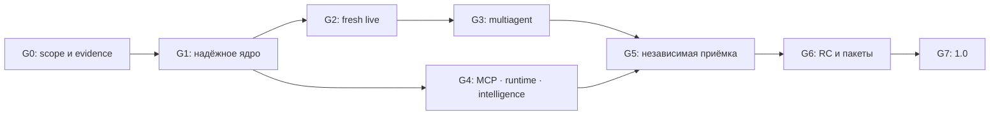

# Приёмка и выпуск Agent Harness 1.0 — Implementation Plan

> **For agentic workers:** REQUIRED SUB-SKILL: Use superpowers:subagent-driven-development (recommended) or superpowers:executing-plans to implement this plan task-by-task. Steps use checkbox (`- [ ]`) syntax for tracking.

**Goal:** Довести локальный агентский харнесс до состава 1.0 и выпустить его после независимой функциональной, платформенной и эксплуатационной приёмки.

**Architecture:** Один Rust-координатор, общий Gateway, SQLite event/intent/receipt ledger и Git-кандидаты. MCP, память, навыки и experiments используют те же policy/budget/fencing контракты. Профили исполнения объявляют фактически проверенные возможности backend.

**Tech Stack:** Rust 1.99.0 / Tokio, SQLite/FTS5, Git, reqwest/rustls; Python только для независимых оценщиков. Optional VM backend применяется при выборе isolated.

**Spec:** [Состав 1.0](../../RELEASE_SCOPE_1_0.md), [исходная архитектура](../../ARCHITECTURE_PLAN.md), [сценарии оценивания](../../EVALUATION_PLAN.md), [матрица критериев](../../../evals/release/acceptance-matrix.json).

Дата: **2026-10-03**. Статус: **план, реализация и полная приёмка ещё не выполнены**. Нормативный порядок: release scope → этот план → версионированная матрица/протокол. Исторические receipts не переписываются.

## Global Constraints

- Ядро: **Rust 1.99.0**, Tokio, локальные SQLite/FTS5 и Git; Python допустим в оценщике, но не требуется установленному CLI.
- Пять бинарных целей: **Linux x64/ARM64, macOS x64/ARM64, Windows x64**; native-проверки проводятся на реальных ОС/архитектурах.
- Целевые floors: **Linux glibc ≥ 2.35**, **macOS ≥ 14**, **Windows 11 x64**; ADR и проверка минимальных версий обязательны до RC.
- Performance: прогретый `--version` **p95 ≤ 100 ms**, idle coordinator **RSS ≤ 40 MiB**, dispatch без I/O **p95 ≤ 5 ms**, managed helper cancellation **≤ 2 s**.
- Все эффекты проходят policy → binding → durable intent → dispatch → receipt; UNKNOWN требует reconciliation, а не слепого повтора.
- REQUIRED unsupported capability → `BLOCKED` до model calls; native/guest/platform downgrade запрещён.
- Варианты B0/B1/H определены в release scope; общие программные guards не отключаются ни в одном режиме.
- **20 dev + 10 новых hidden × 3 configurations × 3 fresh repeats = 270 trials**; общий vector budget и внешний oracle одинаковы.
- Тесты с canned replies остаются fixtures; `harness eval` сохраняет значение component smoke, а не полного release gate.

## Review Focus

1. Потеря ответа после внешнего write или Git update-ref: UNKNOWN/согласованная квитанция, без повторного эффекта — T03/T04/T12.
2. Изменение task/check executable/policy/skill после проверки: сертификат инвалидируется до merge — T02/T17.
3. Windows Unicode/long path/junction/sharing violation и разные диски: scope не обходится, состояние не повреждается — T04/T14/T22.
4. Secrets и инструкции в MCP output, memory или cache: redaction, role separation и отсутствие расширения grants — T09–T12/T15/T16/T19.
5. Смена schema/clock/guest OS во время recovery: исходные budget/deadline/capabilities сохраняются либо запуск блокируется — T04/T05/T14.

---

## 1. Откуда начинаем

Baseline source: **`e10b8dddf03eb96aed4d604d565e9324f58120ce`**, версия **0.1.3**. [Последний CI](https://github.com/Arkus61/agent-harness/actions/runs/37035427836) завершился успешно. Подробно посчитанный [предыдущий CI](https://github.com/Arkus61/agent-harness/actions/runs/37003661236): Rust 191/178/163 PASS на Linux/macOS/Windows, AST 10 на каждой ОС, Python 46/44/44 PASS; 30/30 Linux baseline/control pairs.

| Уже есть | Что ещё не доказано или не реализовано |
| :--- | :--- |
| Agent loop, DAG, worktrees, checks, четыре reviewers, составной candidate binding | Полнота и непротиворечивость evidence на границе gate/publish; все system scenarios |
| SQLite, бюджет, cancel/resume, local outbox | Пять полных crash points; внешние effects; publication intent; обслуживание state |
| Linux bubblewrap, Unix per-process limits | macOS/Windows isolated; aggregate limits; native functional smoke двух дополнительных архитектур |
| Bounded context cache, curated memory, pinned skills, selector | Compaction, dependency applicability, полный skill graph, probes→общий DAG |
| ChatGPT/Codex и OpenAI-compatible | Устойчивая fresh live приёмка новой версии, compatibility matrix и calibration |
| 30 разных задач с контролями | B0/B1 runner, Q08–Q10 evidence hooks, новые закрытые задачи, 270 trials |
| CLI и Actions artifacts | MCP client, согласованные backup/restore/GC, tagged release packages |

Историческая readiness matrix 0.1.3 содержит **42 сценария / 131 критерий**, full-scope verdicts — UNKNOWN. Этот план сохраняет все ID; прошедшие component tests и CI импортируются как отдельные наблюдения, а не автоматический PASS полных сценариев.

Подтверждённые приоритеты: `verification_gate` сейчас проверяет непустой supplied набор checks, а не точное ожидаемое множество; pipeline уже формирует полный набор и составной binding. `publish` сначала обновляет Git ref, затем пишет receipt, без собственного durable publication intent. Это задачи укрепления границ, а не утверждение, что все существующие запуски проверялись без контракта.

## 2. Этапы и условия выхода

| Этап | Работы | Обязательная приёмка |
| :--- | :--- | :--- |
| **G0. Контракт приёмки** | T01 + freeze-подзадачи T07/T19/T20: schema, ConfigSpec, calibration, независимый hidden custody, стенды и протокол | Все 131 ID сохранены; scope, ограничения и новые критерии имеют владельцев; численные пороги закреплены до измерений |
| **G1. Надёжное ядро** | T02–T05 | Полные S01–S05, S07–S12, S19–S20, S38; S06 закрывается внешним adapter в G4; certificate/publication/backup/restore/GC проверки; 0 нарушений блокирующих инвариантов |
| **G2. Реальный агент** | T06–T07 и baseline T19 | Fresh Q02 ×3, затем 6 заранее выбранных разных dev-задач **каждая 3/3**; независимый oracle и calibration |
| **G3. Многоагентный контур** | T08 | S21–S25 и S41; **≥16/20 dev-задач успешны 3/3** на prerelease multiagent-конфигурации; integration/repair/reuse подтверждены |
| **G4. Полная функциональность** | T09–T19 | MCP, isolated backend на трёх host OS, aggregate capabilities, context/memory/graph/SESE/routing; T21/T22 instrumentation/optimization/packaging готовы до RC freeze |
| **G5. Независимая приёмка** | T20, повтор affected gates | **270 trials**, ≥16/20 dev и **≥8/10 hidden успешны 3/3** для H; **stable successes H ≥ B1** на тех же hidden задачах |
| **G6. Release candidate** | T21–T22: измерения/испытания принятой сборки | Все обязательные platform/profile receipts; performance gates; clean install/upgrade/restore; soak; нет открытых P0/P1 release blockers |
| **G7. Выпуск 1.0** | T22 | Exact tag/source/binary hashes, checksums, acceptance bundle, compatibility и migration policy опубликованы |

Порог считается по задачам, а не по отдельным repeats. Stable 3/3 использует только три заранее назначенных primary trial IDs; ERROR неуспешен, diagnostic retries не заменяют их. Error/missing trials сохраняются в знаменателе; отсутствие модели/usage не заменяется нулём. Сценарий запрета успешно проходит при ожидаемом BLOCKED и доказанном отсутствии запрещённого эффекта.

**Блокирующие инварианты для всех этапов:** 0 наблюдённых false/unjustified VERIFIED, unauthorized effects, потерь durable committed state, необоснованных повторов эффекта, credential-canary leaks и silent isolation/platform downgrade. Mandatory UNKNOWN/ERROR/missing не дают PASS.

## 3. Последовательность и параллельная работа

В G0 отдельный QA владелец создаёт/валидирует controls и замораживает private custody manifest десяти hidden задач (T20a); инженеры H не получают содержимое. До первого calibration trial также frozen случаи/labels, непустой critical subset, рубрики/промпты и metric method T07/T19. T20b использует этот набор в G5.

После G0 идут три инженерных потока: **core/evidence**, **MCP/platform**, **context/memory/strategy**. Один независимый владелец QA/oracle не настраивает H по закрытым результатам. Platform spike, сборщики performance baseline и package workflow можно начать параллельно G1; релизные возможности подключаются к общей policy/ledger только после G1.

Ориентир при трёх инженерах и отдельном QA/владельце оценщика: **14–22 календарные недели**, из них G0 3–5 рабочих дней, G1 2–3 недели, G2/G3 2–4 недели, G4 5–9 недель параллельной работы, G5 1–2 недели плюс квоты модели, G6/G7 1–2 недели. Это предварительная оценка, не дата обещанного выпуска. VM/aggregate backend и availability модели определяют критический путь; после spike и fresh Q02 оценка уточняется. Невозможность закрыть обязательную возможность блокирует 1.0 либо требует отдельного, явно более узкого релизного scope до испытаний.

До G5 фиксируются runtime/instrumentation/provider/rubric/guest/package hashes и Cargo version **1.0.0**. RC обозначается каналом/tag manifest; финальный tag указывает на тот же accepted SHA без изменения Cargo после испытаний. В G6 разрешены измерения и проверка уже собранных assets; runtime/hot-path/supervisor/guest изменения возвращают работу к freeze и affected gates. Если изменения H используют hidden feedback, создаётся новый закрытый набор.

## 4. Карта файлов и контрактов

Текущие крупные модули не переписываются целиком. Новые обязанности выделяются в небольшие файлы, а `engine::run` остаётся координатором.

| Обязанность | Файлы реализации | Независимые проверки |
| :--- | :--- | :--- |
| Certificates/publication | новые `src/verification.rs`, `src/publication.rs`; `src/engine.rs`, `src/types.rs`, `src/storage.rs` | новые `tests/verification_certificate.rs`, `tests/publication_recovery.rs` |
| Ledger/recovery | `src/storage.rs`, `src/engine.rs`, `src/outbox.rs`, `src/supervisor.rs`; новый `src/money.rs` | `tests/end_to_end.rs`, `tests/outbox.rs`, `tests/parent_death.rs`; новый `tests/system_faults.rs` |
| Maintenance/replay | новые `src/maintenance.rs`, `src/backup.rs`; `src/replay.rs`, `src/main.rs` | новые `tests/maintenance.rs`, `tests/migrations.rs` |
| Providers/Decision | `src/codex.rs`, `src/provider.rs`, `src/decision.rs`; новый `src/model_router.rs` | `tests/codex_protocol.rs`; новые `tests/provider_compatibility.rs`, `tests/decision_routing.rs` |
| MCP | новые `src/mcp/{mod,config,stdio,http,auth,effects}.rs`; `src/types.rs`, `src/engine.rs` | новые `tests/mcp_{protocol,http,auth,effects}.rs` и fixture servers |
| Runtime/resources | `src/isolation.rs`, `src/resources.rs`; новые `src/runtime_guest.rs`, `src/resources/linux_cgroup.rs` | `tests/isolation.rs`, `tests/resources.rs`; новый `tests/guest_runtime.rs` |
| Intelligence | новые `src/compaction.rs`, `src/memory_service.rs`, `src/skill_graph.rs`, `src/dag_compiler.rs`; существующие context/knowledge/skills/strategy | новые `tests/{compaction,memory_service,skill_graph,strategy_loop}.rs` |
| Acceptance/packaging | новые `evals/system/`, `evals/calibration/`, `evals/performance/`, `evals/release/aggregate.py`, `scripts/package.py`, `.github/workflows/release.yml` | schema validation, external oracles, full scenario receipts, clean VMs |

Предлагаемые API ниже — **контракты будущих задач**, а не список уже доступных функций. Общие records используют versioned serde schemas, typed hashes, explicit enums и `anyhow::Result`; raw provider/MCP payload не является командой.

## 5. Пакеты реализации

Каждый пакет завершается отдельным тестируемым результатом, review и commit. Первые два шага закрепляют отрицательный случай до изменения поведения; большой platform пакет делится на независимые macOS/Windows подзадачи с тем же интерфейсом.

Матрица содержит **42 исходных сценария, 131 исходный + 58 дополнительных критериев = 189**. Все новые full-release verdicts исходно UNKNOWN/not_run; этот файл не отчёт о выполнении.

### T01. Evidence runner и единые конфигурации — G0

**Файлы:** создать `evals/system/run.py`, `evals/release/aggregate.py`, `evals/release/report.schema.json`, `evals/release/configurations.json`, `src/configuration.rs`; изменить `evals/benchmark/suite.py` после заморозки нового corpus manifest.

**Интерфейсы:** `ConfigurationSpec { version, mode: B0|B1|H, features, budget_policy_hash }`; `resolve_configuration(spec: &ConfigurationSpec, task: &TaskSpec) -> Result<EffectiveConfiguration>`. `aggregate(reports, scope, matrix) -> ReleaseVerdict` использует только criterion receipts, не model summaries.

- [ ] Добавить `reject_incomplete_or_stale_scenario_receipt`: отсутствующий критерий, другая платформа/fixture/hash и fixture вместо live → BLOCKED release; полный positive control → PASS.
- [ ] Выполнить новый controller test; убедиться, что current component report не принимается за full scenario.
- [ ] Реализовать schemas/runner, нормативные B0/B1/H и ownership каждого критерия; собирать отдельные criterion/scenario totals.
- [ ] Выполнить schema+controller проверки и сверку всех 131 ID; all mandatory incomplete receipts должны оставаться UNKNOWN.
- [ ] Commit пакета; закрепить scope/config/oracle version и SHA256 manifests до первого live trial; G0 требует freeze deliverables T07/T19/T20a, а не только готовый runner.

### T02. VerificationCertificate и полный gate — G1

**Файлы:** `src/verification.rs`, `src/types.rs`, `src/engine.rs`; `tests/verification_certificate.rs`.

**Интерфейсы:** `VerificationBinding { version, task_hash, plan_hash, candidate_commit, candidate_tree, generation, policy_hash, grants_hash, required_check_hashes, toolchain_environment_hash, skill_manifest_hash, reviewer_rubric_hashes }`; `verify(binding: &VerificationBinding, checks: &[CheckResult], reviews: &[ReviewResult], fixture: bool) -> Result<VerificationCertificate>`. Certificate связывает binding и hashes фактически принятых receipts.

- [ ] Тест `gate_rejects_missing_duplicate_or_inconsistent_check`: удалить один required check, дублировать другой, дать PASS с exit≠0/timeout/cancel → ошибка; exact full set → успех.
- [ ] Запустить новый target в RED; отдельно сохранить existing composite candidate binding как positive regression control.
- [ ] Вынести certificate/gate; проверять expected set, raw receipts, четыре роли, critical/high findings, requirements proofs и fixture mode.
- [ ] `cargo test --locked --test verification_certificate`: изменение каждого binding input инвалидирует старое evidence; полный контроль PASS.
- [ ] Commit; старые receipts остаются историческими, не мигрируют в новый certificate как автоматически доверенные.

### T03. Публикация как durable effect — G1

**Файлы:** `src/publication.rs`, `src/storage.rs`, `src/engine.rs`, `src/execution.rs`; `tests/publication_recovery.rs`.

**Интерфейсы:** `PublicationIntent { id, run_id, certificate_hash, candidate, target_ref, expected_ref, generation }`; `publish_verified(repo: &Repo, store: &Store, intent: &PublicationIntent) -> Result<PublicationReceipt>`. Intent записывается до Git update-ref; повтор использует ту же identity и проверяет фактический ref.

- [ ] Тест `crash_after_ref_update_recovers_exact_publication`: kill после update-ref/до receipt; restart восстанавливает receipt без второго update-ref. Изменённый третьей стороной ref → BLOCKED.
- [ ] Запустить RED и доказать отдельным Git read, что effect выполнен, а receipt отсутствует.
- [ ] Добавить durable intent, verification-certificate recheck, CAS/fast-forward/unoccupied-ref guard и independent reconciliation.
- [ ] Новый target + existing merge tests PASS: fixture/corrupt certificate/другой SHA/check-set отклонены; success сохраняет user HEAD.
- [ ] Commit; отразить recovery path в CLI guide.

### T04. Полная crash/cancel/budget матрица — G1

**Файлы:** `src/storage.rs`, `src/engine.rs`, `src/outbox.rs`, `src/supervisor.rs`, `src/execution.rs`, новый `src/money.rs`; `tests/system_faults.rs`, существующие end_to_end/outbox/parent_death.

**Интерфейсы:** existing Store intents/receipts/reserve/settle; новый `FaultPoint` фиксирует before_transaction / after_intent / after_dispatch / after_effect / after_receipt; `ScenarioReceipt` из T01 связывает независимые effect counters. `MoneyBudget { currency, max_microunits, tariff_hash }`, `BillingReceipt { provider, request_id, currency, amount_microunits, tariff_hash, evidence_hash }`; `reserve_money(store: &Store, call_id: &str, estimate: &MoneyAmount) -> Result<()>`, `settle_money(store: &Store, receipt: &BillingReceipt) -> Result<()>` атомарны/idempotent, расчётная/подтверждённая/UNKNOWN стоимость различается.

- [ ] Тест `five_crash_points_preserve_committed_effect_and_budget`: controlled error и настоящий process termination на каждой точке; Windows termination выполняется нативно.
- [ ] Запустить RED для отсутствующих вариантов: clock jump/backward, parallel token/money reservations всех ролей/probes, duplicate/stale billing receipt, currency/tariff mutation, unknown cost, late generation result, cancel race, path/CRLF/junction/sharing violations.
- [ ] Реализовать fixed-point monetary reserve/settle с frozen tariff и trusted billing-receipt adapter; backend без требуемого billing/capability блокируется, computed cost не выдаётся за billed amount. Завершить recovery/fencing и stable wall-deadline policy: rollback часов не продлевает original deadline; unknown usage остаётся reserved, settlement требует evidence.
- [ ] Полные S01–S05/S07–S12/S19/S38 на трёх ОС с positive controls, raw logs и effect traps; process kill не объявляется доказательством power-loss durability.
- [ ] Commit; обновить capability/errors documentation без ослабления исходных grants.

### T05. State integrity, backup/restore, миграции и GC — G1

**Файлы:** `src/maintenance.rs`, `src/backup.rs`, `src/replay.rs`, `src/storage.rs`, `src/main.rs`; `tests/maintenance.rs`, `tests/migrations.rs`.

**Интерфейсы:** `backup(store: &Store, destination: &Path) -> Result<BackupManifest>`; `restore(manifest: &BackupManifest, destination: &Path) -> Result<RestoreReport>`; `gc(store: &Store, dry_run: bool) -> Result<GcReport>`. Restore destination новый; pending effects/reservations сохраняются. Replay реконструирует весь заявленный набор projections read-only.

- [ ] Тест `backup_restore_and_gc_preserve_unknown_effects_and_pinned_evidence`: WAL snapshot + referenced CAS; missing/corrupt object → отказ; dry-run не меняет state.
- [ ] RED: interruption миграции/GC, disk-full/permission/busy, saved v1/v2/v3 fixtures и unsupported future schema.
- [ ] Реализовать consistent backup, transactional migration, reachability/pins и lock/generation recheck; GC не удаляет active/unknown/pending/certificate/retained-backup objects.
- [ ] Round-trip PASS; сохранённый ответ имеет source/task/policy/model/prompt/role/skill/context/version provenance; изменение любого существенного input запрещает fresh verification без новой проверки. Model-response hot cache для этого не нужен. Потерянный объект обнаружен; replay не вызывает provider/tools/outbox; interruption restart-safe.
- [ ] Commit; документировать backup перед upgrade и пределы проверенной durability на локальном диске.

### T06. Provider compatibility и свежий single-agent pilot — G2

**Файлы:** `src/provider.rs`, `src/codex.rs`, `src/main.rs`; `tests/provider_compatibility.rs`, Codex tests; `evals/live/run.py`.

**Интерфейсы:** existing `ProviderResponse/Usage`; versioned `ProviderCapabilities` сообщает JSON/usage/cancellation/output-cap особенности и tested CLI versions.

- [ ] Тест `provider_partial_reply_or_usage_never_verifies`: malformed/truncated JSON, unauthorized, missing usage, timeout/EOF и protocol drift → typed failure/UNKNOWN, secrets отсутствуют в публичной диагностике.
- [ ] Выполнить transport tests в RED для новых случаев; live calls в unit tests не включать.
- [ ] Укрепить compatibility checks и lifecycle; supported monetary API adapter принимает независимый BillingReceipt, а отсутствующий receipt оставляет cost UNKNOWN. Подписку не засчитывать денежным бюджетом. Сохранить официальный Codex login и отключение inherited tools/MCP; мягкий Codex output cap явно показывать в capabilities.
- [ ] Fresh Q02 ×3, затем шесть заранее выбранных dev-классов ×3: внешняя приёмка exact commits, complete usage, 0 false VERIFIED; сохранять failed/blocked attempts.
- [ ] Commit и receipts freeze; смена release binary делает прежний pilot историческим доказательством.

### T07. Независимость и calibration четырёх reviewers — freeze G0 / испытания G2

**Файлы:** reviewer code `src/engine.rs`, rubric manifests; новые `evals/calibration/reviewers/` и `tests/reviewer_context.rs`.

**Интерфейсы:** `ReviewerCase { id, role, baseline, candidate, confirmed_defect, counterexample, rubric_hash }`; calibration receipt связывает case/rubric/model и конкретное source evidence.

- [ ] Тест `reviewer_payload_excludes_builder_claims_and_receipts_are_bound`: builder canary/self-summary не передаются; trusted requirements/source/runner receipts доступны.
- [ ] RED для wrong candidate, missing evidence, stale review и критического defect с PASS.
- [ ] Зафиксировать 40 случаев: 5 defective +5 clean на каждую роль, из defective минимум один заранее отмеченный critical на роль; independent counterexamples, blind author/rank, версия rubric.
- [ ] Calibration gate: ≥18/20 defects обнаружены, ≥4/5 каждой ролью, ≤2/20 clean ложных блокировок, 0 пропущенных заранее отмеченных critical defects. UNKNOWN считается отдельно и не является обнаружением; blocking UNKNOWN/Abstain/malformed/timeout на clean case входит в false-blocker denominator; показатели малого корпуса не объявлять универсальными вероятностями.
- [ ] Commit private custody/public hash manifests rubric/corpus/critical subset в G0 до первого calibration trial; critical subset непустой на каждой роли, а tuning rubric требует нового calibration split; новые результаты не заменяют первоначальные FAIL receipts.

### T08. DAG, integration, repair и reuse — G3

**Файлы:** `src/engine.rs`, `src/execution.rs`; tests end_to_end/parallel_failure; новые `tests/dag_recovery.rs`.

**Интерфейсы:** existing TaskNode/AttemptRecord/validate_plan; `PlanRevision` закрепляет dependency snapshots и shared contract versions; `DagCompiler` T18 использует тот же validator.

- [ ] Тест `failed_branch_repairs_from_integrated_candidate_without_replaying_good_branch`: A→B,C→D; exact inputs/outputs и независимые counters подтверждают reuse совместимой ветви.
- [ ] RED для invalid DAG до dispatch, conflicting deltas, changed common API, resource saturation и sibling failure masking.
- [ ] Добавить explicit contract revisions, точный repair routing и bounded parallel permits; новые результаты старого generation не принимаются.
- [ ] S21–S25/S41 PASS; ≥16/20 dev-задач успешны 3/3; serial/parallel correctness одинаковы, speedup публикуется по измерениям.
- [ ] Commit; concurrent model/build limits фиксируются отдельно и сохраняются в report.

### T09. MCP manifests и stdio client — G4

**Файлы:** `src/mcp/{mod,config,stdio}.rs`, `src/types.rs`, `src/supervisor.rs`; `schemas/mcp-server.schema.json`, `tests/mcp_protocol.rs`.

**Интерфейсы:** `McpServerManifest { version, identity, transport, executable_or_endpoint, tool_schema_hashes, trusted_effects, credentials_ref, capabilities }`; `McpClient::connect(manifest: &McpServerManifest, deadline: Instant, cancel: CancellationToken) -> Result<McpSession>` — async. `McpGrant { server_manifest_hash, allowed_tools, argument_constraints, resource_uri_scopes, allowed_prompts, allowed_effects }` задаёт frozen server/tool/schema/argument/URI разрешения; model discovery не добавляет grants. Protocol version/SDK choice фиксируется ADR; использовать поддерживаемый Rust SDK, если он проходит ограничения и protocol fixtures.

- [ ] Тест `stdio_protocol_and_schema_drift_fail_closed`: init/version negotiation, fragmented/oversized frames, hanging initialize, malformed reply и изменённая tool schema.
- [ ] RED с fixture server и positive контрольным tool; stdout строго protocol, stderr bounded diagnostics.
- [ ] Реализовать supervised stdio transport без implicit shell, discovery freeze и server/tool/schema identity.
- [ ] Protocol matrix PASS на трёх ОС; cancel/owner death убирают управляемое server tree; manifest drift требует нового разрешения.
- [ ] Commit; readOnlyHint/idempotentHint документируются как сведения, а не полномочия.

### T10. MCP Streamable HTTP — G4

**Файлы:** `src/mcp/http.rs`, `src/mcp/config.rs`; `tests/mcp_http.rs`.

**Интерфейсы:** HTTP transport реализует тот же McpClient/McpSession; `EndpointPolicy` фиксирует scheme/origin/resolved-address policy, credentials forwarding и remote consent.

- [ ] Тест `http_stream_resume_does_not_resubmit_tool_call`: HTTP/SSE framing, session/version headers, notifications, disconnect и duplicate response.
- [ ] RED для redirects/cross-origin credentials, DNS/address-policy drift, unexpected endpoint и truncated/oversized stream.
- [ ] Реализовать HTTPS; loopback HTTP только по явной настройке, bounded response/CAS, deadline и auth-expiry states.
- [ ] Transport tests PASS; запрещённый endpoint не получает запрос; возобновление stream не повторяет effect.
- [ ] Commit; legacy отдельный HTTP+SSE transport остаётся вне 1.0.

### T11. MCP authentication — G4

**Файлы:** `src/mcp/auth.rs`, новый `src/credentials.rs`; `tests/mcp_auth.rs`.

**Интерфейсы:** `CredentialRef` содержит только идентификатор; `AuthSession` использует protected-resource/authorization discovery, PKCE/state/redirect binding и безопасное сохранение refresh state. Точная версия auth protocol фиксируется ADR до реализации.

- [ ] Тест `oauth_state_pkce_origin_and_refresh_are_bound`: invalid state/redirect/resource/audience/issuer отклонён; tokens не присутствуют в manifests/logs/export.
- [ ] RED: expired token, interrupted login, concurrent refresh, consent denial и подмена discovery endpoint.
- [ ] Реализовать поддерживаемые OAuth/PKCE и environment/static credential references через защищённый store; token requests только разрешённым origin.
- [ ] Controlled authorization-server integration PASS; auth error не вызывает silent credential/provider fallback.
- [ ] Commit compatibility/auth matrix; сторонние неиспытанные auth extensions не объявлять поддержанными.

### T12. MCP effects, Gateway и внешние workers — G4

**Файлы:** `src/mcp/effects.rs`, `src/types.rs`, `src/engine.rs`, `src/storage.rs`, `src/outbox.rs`, `src/codex.rs`, `src/provider.rs`; `tests/mcp_effects.rs`.

**Интерфейсы:** `Action::McpCall { server, tool, arguments, manifest_hash }`, resource/prompt reads как bounded read effects; `EffectClass = ReadOnly|IdempotentWrite|NonIdempotentWrite`. Remote mutation использует durable ActionRecord и `EffectReceipt/NoEffectReceipt` с server identity, payload hash, key и fencing. `McpSession::call(tool: &str, arguments: &Value, context: &McpCallContext, cancel: CancellationToken) -> Result<McpCallResult>` — async; context содержит action/run/manifest identity, optional idempotency key и deadline.

- [ ] Тест `lost_write_reply_blocks_retry_until_independent_reconciliation`: server effect=1, disconnect, restart; auto-repeat отсутствует; request/session IDs не заменяют idempotency key.
- [ ] RED для forbidden tool/argument/role, cancel acknowledgement после write, worker grant expansion, tool-result prompt injection и stale fence.
- [ ] Подключить transports через общий action Gateway/DecisionScope, обновить ModelReply/outputSchema обоих providers для новых действий; обеспечить trusted worker registration вне coordinator process и bounded resource/prompt/tool outputs.
- [ ] S06/S39 + MCP effects PASS. Дополнительно combined native/isolated MCP positive/negative cases на трёх host ОС: stdio в isolated; HTTP broker/auth store на host с scoped guest RPC, без передачи credentials гостю; forbidden arguments/schema drift/cancel/restart проверены. Далее: read retries bounded; write retries только по доказанному backend контракту с тем же key; неизвестный сервер требует isolated либо явного native-trusted доверия.
- [ ] Commit и один controlled external mutating adapter с независимым effect counter; универсальную exactly-once гарантию не заявлять.

### T13. Linux confinement и aggregate limits — G4

**Файлы:** `src/isolation.rs`, `src/resources.rs`, `src/resources/linux_cgroup.rs`; tests isolation/resources.

**Интерфейсы:** `ResourceCapabilities` разделяет hard memory/pids/disk, cpu_rate и accumulated_cpu_budget с polling/overshoot metadata. Один root task cgroup/VM budget/volume охватывает builders/checks/probes/stdio workers и все worktrees до exec; coordinator/state/remote services исключены явно. Gateway writes и snapshot transfer не обходят volume cap; отдельный staging cap входит в ledger. Repair/resume не сбрасывает cumulative CPU usage.

- [ ] Тест `aggregate_limits_cover_children_and_many_small_files`: два builders каждый ниже command cap, но вместе превышают root task RAM/PIDs/CPU budget; множество небольших файлов достигают workspace volume quota.
- [ ] RED для namespace escape, host credentials/state/shared Git access, quota bypass и cleanup после parent death.
- [ ] Реализовать cgroup v2 + отдельный ограниченный filesystem volume; sampled CPU watchdog: polling100ms, fixture2cores, observed overshoot≤1CPU-second на ≥100 stress runs; это заранее заданный corpus gate, не абсолютный scheduler bound. Hard aggregate_cpu_seconds остаётся unsupported при watchdog; cpu.max не выдаётся за CPU-seconds cap.
- [ ] S37 и resource matrix PASS: unrelated processes не ограничены; unsupported required capability блокируется до модели; OS privileges не ослабляются автоматически.
- [ ] Commit capability/probe report и guest-compatible contract для T14.

### T14. Isolated backend на macOS и Windows — G4

**Файлы:** `src/runtime_guest.rs`, platform adapters, `src/isolation.rs`; `tests/guest_runtime.rs`, guest image manifest.

**Интерфейсы:** `GuestRuntime::probe() -> RuntimeCapabilities`; `GuestRuntime::execute(snapshot: &CandidateSnapshot, command: &CommandSpec, limits: &ResourceLimits, cancel: CancellationToken) -> Result<CommandResult>` — async. Отдельные macOS/Windows реализации используют один frozen guest protocol; host/guest OS и toolchain входят в binding.

- [ ] Два независимых RED набора: `mac_guest_refuses_host_shares_and_cleans_after_death` и `windows_guest_refuses_host_shares_and_cleans_after_death`; отдельные native positive controls.
- [ ] Spike: macOS Virtualization.framework и Windows Hyper-V/проверенный системный backend; закрепить image hashes, optional installation и права, minimum host kernel/FS/hypervisor build/edition requirements и подтверждающие probes. Не использовать deprecated sandbox-exec как release guarantee.
- [ ] Реализовать snapshot transfer без общего writable `.git`/home/state, закрытую по умолчанию сеть, trusted checks и guest quotas; compatible target OS requirement проверяется до запуска.
- [ ] S37/S39 на двух настоящих host ОС PASS; network/filesystem/credential/quota attacks и crash cleanup с независимыми traps; Linux guest receipt не засчитывается как native Windows/macOS check.
- [ ] Отдельные commits/reviews для macOS и Windows; недоступный hypervisor → BLOCKED, native default остаётся быстрым.

### T15. Context Shunt и structured compaction — G4

**Файлы:** `src/context.rs`, `src/context_cache.rs`, `src/compaction.rs`; `tests/compaction.rs`.

**Интерфейсы:** `compact(input: &ContextState, budget_bytes: usize) -> Result<CompactionPacket>`; packet содержит immutable requirements/grants/gates, exact source refs, unresolved claims и retained state hashes. Новый ClaimStatus различает проверяемую поддержанность и UNKNOWN; простая ссылка не становится entailment.

- [ ] Тест `compaction_preserves_mandatory_constraints_and_invalidates_stale_source`: 10k файлов, связанная причина в нескольких слоях, source replacement и partial-secret boundaries.
- [ ] RED: утрата обязательного условия, unsupported claim, revoked grants на cache hit и contaminated role/root. Semantic controls: текущий источник, не поддерживающий claim → UNKNOWN; реально поддержанный critical claim → пригодный independent semantic receipt, без тривиального UNKNOWN для всех.
- [ ] Реализовать source-backed narrowing/extraction, structured state reduction и bounded expansion; при нехватке места для mandatory данных BLOCKED/разрешённый более ёмкий backend.
- [ ] S26/S27/S42 и Q08 evidence PASS: 0 потерянных mandatory constraints на corpus; all critical claims source-current либо UNKNOWN; original source можно открыть.
- [ ] Commit; measured token/time gains отделены от semantic correctness.

### T16. MemoryService и durable promotion — G4

**Файлы:** `src/memory_service.rs`, `src/knowledge.rs`, `src/outbox.rs`, `src/engine.rs`; `tests/memory_service.rs`.

**Интерфейсы:** `MemoryDependency { source, hash, range, condition }`; `MemoryService::retrieve(scope: &MemoryScope, dependencies: &[MemoryDependency]) -> Result<Vec<MemoryRecord>>`; episode delivery idempotent по run/candidate/event identity. Promotion требует independent provenance receipt.

- [ ] Тест `dependency_change_stales_memory_but_unrelated_change_does_not`: conflict/supersession, role/project separation и reviewer builder-canary exclusion.
- [ ] RED: admin/import secret retention, lost async-write response, repeated delivery и candidate episode auto-promotion.
- [ ] Добавить versioned dependencies/authority/confidentiality/applicability, lifecycle и durable async write; admin/import использует отдельную SecretPolicy на ingestion, а не только task-specific filter; memory error не отменяет Verified result.
- [ ] S28–S30 и Q09 hooks PASS; active retrieval только применимых записей; contested/stale/quarantined data не используется.
- [ ] Commit; training memory и hidden acceptance разделены.

### T17. Полный минимальный Skill Graph — G4

**Файлы:** `src/skill_graph.rs`, `src/skills.rs`, `src/dag_compiler.rs`; `tests/skill_graph.rs`.

**Интерфейсы:** versioned `SkillEdge { kind, from_version, to_version, provenance }`; `resolve_path(request: &SkillRequest, registry: &SkillRegistry, grants: &Grants) -> Result<PinnedSkillPath>`. Path закрепляет hashes packages/edges, а не latest.

- [ ] Тест `skill_path_rechecks_quarantine_on_resume`: install/change-body/cycle/missing prerequisite/conflict/permission denial; безопасный approved путь проходит.
- [ ] RED для runtime quarantine после plan, stale edge и semantic similarity без required prerequisite.
- [ ] Lifecycle Candidate→Scanned→Tested→Verified→Approved; ограниченный versioned graph с восемью отношениями из release scope/architecture; scripts используют Gateway/isolated, не import hooks.
- [ ] S34/Q09 PASS; depth/node/time bound соблюдён, all executed packages/edges входят в verification manifest.
- [ ] Commit; graph usefulness сравнивается с тем же плоским каталогом.

### T18. SESE/probes → общий DAG — G4

**Файлы:** `src/strategy.rs`, `src/dag_compiler.rs`, `src/engine.rs`; `tests/strategy_loop.rs`.

**Интерфейсы:** `DagCompiler::compile(strategy: &SelectedStrategy, skills: &PinnedSkillPath, task: &TaskSpec) -> Result<PlanRevision>`; `ProbeResult` связывает real action receipts, environment/unit/sample hashes и shared budget. SIMPLE обоснован; STANDARD ≤3 candidates/≤2 probes.

- [ ] Тест `unknown_requirement_runs_bounded_probe_and_selected_strategy_reaches_gate`: hard FAIL исключён; synthetic value не принимается как measured result; runner-up только при совместимых effect/state.
- [ ] RED: different environments/units, fabricated measurement, spent probe budget omitted, variant=тот же механизм под другим именем.
- [ ] Выполнить experiments через общий Gateway/ledger, сравнить evidence, сохранить reasons/runner-up/switch conditions и скомпилировать выбранный вариант через existing DAG validation.
- [ ] S35/S36/Q10 PASS: реальные probes, SIMPLE fast path, одинаковые критерии и budget, final exact candidate external PASS.
- [ ] Commit; MCTS/DEEP не требуется для bounded 1.0.

### T19. Routing и Decision calibration — freeze G0 / G2/G4

**Файлы:** `src/model_router.rs`, `src/decision.rs`, `src/provider.rs`, `src/skills.rs`; `tests/decision_routing.rs`, `evals/calibration/decisions/`.

**Интерфейсы:** `route(request: &RoutingRequest, allowed: &[ProviderCapabilities], scope: &DecisionScope, budget: &Budget) -> Result<RoutingDecision>`; decision возвращает allowed model/version либо Abstain. Rubric/backend/calibration и action binding версионируются.

- [ ] Тест `allow_assessment_cannot_override_deny_or_select_unallowed_model`: changed action/grants/environment, unavailable backend и malformed/abstaining reply не расширяют права.
- [ ] RED: русский/английский ввод, contradictory instructions, incomplete evidence, tool/skill unavailable и confidentiality mismatch.
- [ ] ADR заменяемого neural backend; shadow evaluation прежде enforced routing. Общая программная policy всегда включена.
- [ ] ≥120 frozen cases, по 40 routing/tools-skills/risk: в каждой группе 20 clean, 10 invalid (с непустым заранее отмеченным critical subset) и 10 insufficient/contradictory. Gate: 0 deterministic-DENY violations и critical false allows; ≥38/40 допустимых outputs для clean routing/tools cases; ≤6/60 ложных блокировок общего clean set; UNKNOWN/malformed отдельно, не успешный output; clean Abstain/HOLD/UNKNOWN/malformed/timeout, препятствующий исполнению, входит в <=6/60 false-blocker denominator. Baseline static Decision входит в G2, динамическая маршрутизация принимается в G4.
- [ ] Commit rubric/calibration/correct-label/nonempty-critical-subset manifests в G0 до первого calibration trial; tuning требует нового evaluation split; имя Jev/Choice/Score/Noul не используется как доказательство качества.

### T20. Настоящее сравнение и hidden controller — T20a/G0 и T20b/G5

**Файлы:** `evals/benchmark/suite.py`, новый comparison runner, private holdout controller, `evals/release/aggregate.py`; config spec T01 и current hooks Q08–Q10.

**Интерфейсы:** `TrialManifest` содержит configuration/task/model/budget/seed/candidate/oracle/usage hashes. Separate `trial_pass`, `scenario_pass`, `stable_success` вычисляются из independent criterion receipts. Общий behavioral oracle/denominator одинаков у B0/B1/H; H-only subsystem proof Q08–Q10 учитывается отдельно как release capability gate, отсутствие отключённых функций не делает baseline автоматически FAIL. Shared requirements содержат достаточные task facts для всех configurations.

- [ ] Тест `comparison_rejects_reused_seed_or_h_as_baseline`: одинаковый mode fingerprint под B0/B1/H, previous candidate seed, changed oracle и hidden output feedback → отказ.
- [ ] RED для пропуска errors/unknown costs, fictitious hooks/evidence и public H1 как hidden.
- [ ] **T20a выполняется в G0:** независимый QA создаёт 10 новых закрытых задач отдельно от авторов H, private custody и public hashes; freeze controls/oracles; Q08–Q10 требуют реальных hooks/receipts. **T20b/G5** использует frozen набор; полный runner исполняет нормативные конфигурации с чередованием/рандомизацией порядка.
- [ ] 270 fresh trials: H ≥16/20 dev и ≥8/10 hidden устойчиво 3/3, H hidden stable≥B1; positive baseline/control proof, mutation/structural/black-box oracles по применимости, task-level uncertainty/raw outcomes. Stable3/3 только по заранее назначенным primary IDs; ERROR неуспех, diagnostic retry отдельно.
- [ ] Commit protocol до запусков; after-run receipts immutable. Дополнительные ablations оценивают memory/graph/compaction/probes; для auto-enable нужен заранее выбранный ≥10% выигрыш целевой метрики без ухудшения stable success, иначе функция остаётся явно выбираемой.

### T21. Native performance и bounded operation — подготовка G0–G4 / измерения G6

**Файлы:** `evals/performance/manifest.json`, performance runner; native dispatch/RSS instrumentation, `tests/performance_contracts.rs`.

**Интерфейсы:** `PerformanceManifest` фиксирует machine/source/binary/toolchain/OS/CPU-power/warmup/sample policy. RSS coordinator/tree и pure dispatch/filesystem/provider/VM времена раздельны.

- [ ] Тест `performance_manifest_rejects_different_machine_or_fixture_timing`: synthetic timings и другой binary не закрывают release gate.
- [ ] Зафиксировать эталонные стенды каждой OS family; выполнить ≥1000 startup/dispatch samples после ≥100 warm-up, RSS ≥100 samples; cold runs отдельно.
- [ ] До G5 instrumentation/baseline и оптимизация только обнаруженного hot path; correctness/invalidation/redaction не ослаблять, idle measurements не включают локальную модель.
- [ ] В G6 без изменения accepted runtime: на трёх закреплённых стендах warm p95≤100 ms / RSS≤40 MiB / dispatch p95≤5 ms / managed helper cleanup≤2 s; cancellation корпус ≥100 повторов с max; VM/MCP/LLM end-to-end данные отдельно.
- [ ] Commit raw performance bundle; шумные shared CI runners используют диагностический regression monitor, не аппаратный абсолютный release verdict.

### T22. Пакеты, RC, upgrade и выпуск — подготовка G0–G4 / G6/G7

**Файлы:** `.github/workflows/release.yml`, `scripts/package.py`, `docs/INSTALL.md`, release notes, package smoke scripts.

**Интерфейсы:** `ReleaseManifest` связывает tag/commit/Cargo.lock, пять assets и SHA256, scope/report/certificate hashes, ABI/dependencies, SBOM/licenses и provenance. Checksums/attestation не называются доказанной bit-for-bit reproducibility.

- [ ] Тест `clean_package_install_upgrade_and_restore`: готовый asset работает без Rust/Python; wrong checksum и incompatible state schema отклонены; backup/rollback restores validated state.
- [ ] RED для отсутствующей архитектуры, старого ABI, missing supervisor/guest assets и несовпадения version/tag/binary.
- [ ] До freeze G5 подготовить package/runtime/guest assets и version1.0.0; native builds+полные portable contract suites+smoke на пяти exact target IDs, floor receipt для каждого target; Unix tar.gz/Windows ZIP; signed/notarized либо явно unsigned status. Git/Codex/project toolchains проверяются doctor отдельно.
- [ ] RC soak ≥24h и ≥100 fixture runs на каждой из трёх ОС: task start/cancel/restart/outbox/GC; 0 orphan managed processes, monotonic retained state growth соответствует retention, no mandatory evidence loss. Clean install/upgrade/native recovery PASS на пяти целях, полный acceptance bundle проходит aggregator.
- [ ] Независимый reviewer QA подписывает gate report; tag и packages публикуются только для exact accepted SHA. Выпуск — отдельная явно запрошенная операция, а не автоматическое действие при написании этого плана.

## 6. Матрица полного покрытия S01–S42

| Сценарии | Владельцы пакетов | Когда закрываются |
| :--- | :--- | :--- |
| S01–S05, S07–S12, S38 | T04/T05 | G1 |
| S06 | T12 | G4: доказанный external idempotency contract |
| S13–S18 | T02/T06/T07 | G2 с production/negative evidence |
| S19–S20 | T04/T03 | G1 |
| S21–S25, S41 | T08 | G3 |
| S26–S27 | T15 | G4 |
| S28–S30 | T16 | G4 |
| S31–S33 | T19/T06 | baseline G2, полный routing G4 |
| S34 | T17 | G4 |
| S35–S36 | T18 | G4 |
| S37, S39 | T13/T14/T12 | G4 на трёх host ОС и всех заявленных capabilities |
| S40 | T21 | G6 |
| S42 | T05/T15 | G4; final state/GC repeat G6 |

Все **131 исходный criterion ID** присутствуют в JSON-матрице; MCP/auth/quotas/maintenance/provider/quality/release добавлены отдельными R-ID. Неосуществлённая обязательная функция не становится NOT_APPLICABLE из-за отсутствия реализации. Применимость определяется scope/task до запуска; исходный обязательный профиль не исключается задним числом.

## 7. Доказательства и правила verdict

Criterion receipt содержит scenario/criterion ID, scope/catalog/config/schema versions, fixture/oracle/source/binary hashes, OS/guest/kernel/architecture/FS/CPU/toolchain, profile/effective capabilities, baseline/candidate commit/tree, task/policy/grants/check/review/context/skill fingerprints, signal/exit/status/effect counters, usage/spent/reserved/unknown, monotonic timestamps и artifact hashes.

- **PASS:** обязательное условие выполнено в заявленной scope с пригодными независимыми доказательствами.
- **FAIL:** наблюдается конкретное нарушение; сохраняется исходный receipt.
- **UNKNOWN:** доказательств недостаточно, включая missing/skip/partial/неполный platform matrix.
- **ERROR:** сломан оценщик/среда; trial сохраняется, повтор только по правилу до испытаний.
- **NOT_APPLICABLE:** заранее заданное правило доказало неприменимость; поле «функция не реализована» не подходит.

До повторов закрепить retry policy: provider/environment ERROR имеет не более одного отдельного fresh повторения после независимой диагностики; первоначальный trial остаётся в таблице и denominator. Diagnostic retry не входит в primary stable3/3 и не заменяет неуспех. Behavioral FAIL, false VERIFIED и gate failure не удаляются и не чинятся внутри hidden trial. После изменения кода создаётся новая campaign с новым release SHA.

Artifact bundle размещается вне прав кандидата: scope/matrix, ScenarioReceipts, TrialManifests, сырой stdout/stderr с redaction, counters, hashes, summaries, full gate verdict. Private holdout сохраняется в отдельном хранилище оценщика; public report раскрывает только разрешённые агрегаты/идентификаторы, а не секретные случаи или credentials.

Принятые unaffected receipts допускаются для G1/G4 только при доказанной неизменности полного dependency manifest и новой независимой агрегации. Финальный G5 benchmark и G6 package/soak проводятся на release candidate SHA. Любое изменение runtime/rubric/provider contract требует соответствующего повторного gate; изменение качества H после hidden feedback требует нового закрытого набора.

## 8. Первые пять рабочих действий

1. T01: заморозить scope/matrix/B0-B1-H и report schema; каждому criterion назначить владельца и executable scenario.
2. T02: negative test полноты required checks, затем VerificationCertificate с existing composite binding.
3. T03: kill после Git update-ref, восстановить exact publication receipt без повтора эффекта.
4. T04: полная lost-effect/unknown-usage/cancel матрица и native CI без пропущенных обязательных capabilities.
5. T06: свежий Q02 ×3 с внешней приёмкой на новой сборке; только после него расширить live pilot и уточнить календарь.

Планирование не запускает новые model calls и не выпускает 1.0. Следующая исполняемая часть — G0/G1; MCP/platform/intelligence готовятся параллельно после фиксации общих контрактов.
